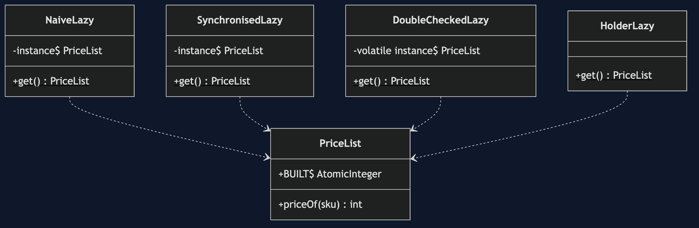
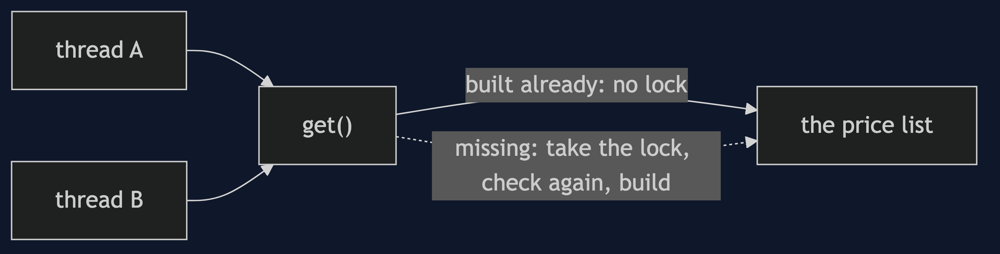
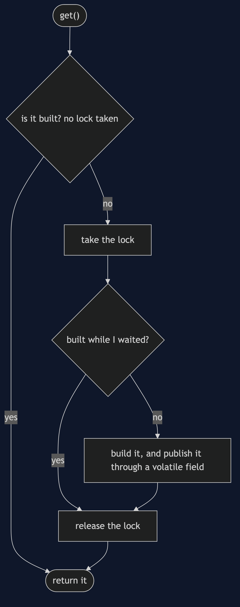
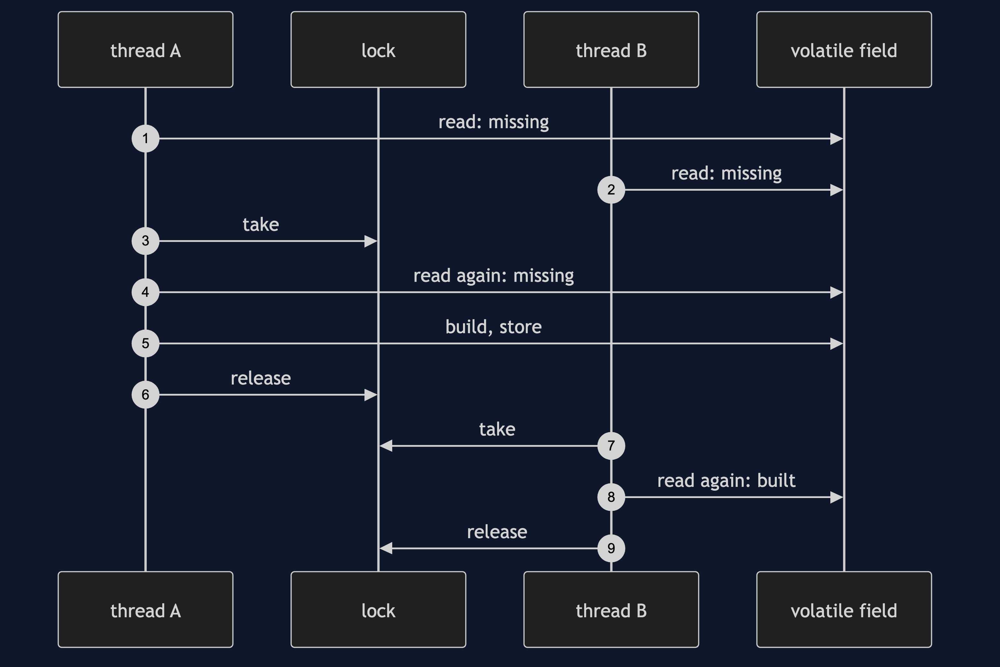
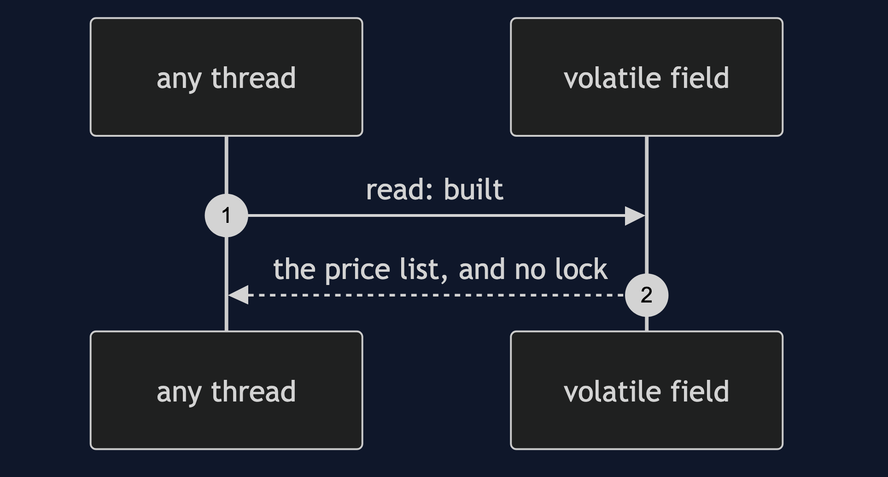

# Double-Checked Locking Pattern

```
src/main/java/com/jk/explore/doublechecked/
├── DoubleCheckedDemo.java           the six acts
├── NaiveLazy.java                   check, then create: unprotected
├── SynchronisedLazy.java            correct, with the lock on every call
├── DoubleCheckedLazy.java           check, lock, check again; a volatile field
├── HolderLazy.java                  the simplest correct way: a class holder
├── Rendezvous.java                  a hook that makes the race happen every time
└── PriceList.java                   counts its builds
```

**Double-checked locking builds a shared object once, and takes the lock only while it is being built.**

This project is in [concurrency-design-patterns](..). It is the concurrent partner of [Singleton](../../creational/singleton-pattern) and [Singleton with Spring](../../creational/singleton-with-spring-pattern), and a warning as much as a pattern.

## Run

```bash
./gradlew run
```

Six acts. Every number quoted below comes from this program's own output.

```
ONE. Check, then create.
  two threads ask for the shared price list at the same moment, before it exists.
  price lists built: 2. both saw that it was missing, and both built one.
  each thread now holds a different price list, and one of them is thrown away.
TWO. Lock every time.
  the same two threads, with the lock on every call: built 1.
  1000 more calls, long after it was built, took the lock 1000 times.
THREE. Check, lock, check again.
  the same race: built 1. the second thread waited for the lock, looked again, and found it built.
  1000 calls: the lock was taken 1 time. after that, no call waits for anyone.
FOUR. Why it must be volatile.
  the field is declared volatile: true.
  without it, the Java memory model lets one thread see the reference before it sees the object built.
  that failure cannot be produced on demand. it depends on the processor and the compiler. so the rule is guarded by a test, not by a demonstration.
FIVE. The simplest correct way.
  price lists built before anyone asks: 0.
  after two calls: 1 built, the same one both times: true.
  the JVM builds a class's static state once, when it is first used. there is no lock and no volatile to write, or to get wrong.
SIX. The bill.
  lines of code in the accessor's class: double-checked 29, holder 10.
  double-checked locking is ceremony with one way to be subtly wrong. it earns its place only where the holder idiom cannot be used, for example when creation needs an argument.
  and an uncontended lock is cheap. measure before deciding the lock on every call is a problem.
```

## Test

```bash
./gradlew test
```

2 test classes, 8 test methods, offline, with nothing installed and no framework.

## Technologies and versions

| What | Version | Why it is here |
| --- | --- | --- |
| Java | 21 | The repository standard, via the Gradle toolchain block |
| Gradle | 9.2.1 | The wrapper in this directory; no separate install needed |
| JUnit 5 | 5.10.2 | Test runner |

No framework. A hand-built project stays plain Java so the mechanism is the whole lesson.

## Learning Material

| Document | What it covers |
| --- | --- |
| [`docs/problem-statement.md`](docs/problem-statement.md) | The scenario, and the problem |
| [`docs/double-checked-locking-pattern-explained.md`](docs/double-checked-locking-pattern-explained.md) | The pattern, and six acts |
| [`docs/class-diagram.md`](docs/class-diagram.md) | The types |
| [`docs/architecture-diagram.md`](docs/architecture-diagram.md) | The parts and how they connect |
| [`docs/data-flow-diagram.md`](docs/data-flow-diagram.md) | What happens to one request |
| [`docs/sequence-diagram.md`](docs/sequence-diagram.md) | Written for a listener with the screen off |
| [`docs/uml-diagram.md`](docs/uml-diagram.md) | Four sequences |
| [`docs/animation.html`](docs/animation.html) | The six acts in a browser |
| [`docs/prerequisites.md`](docs/prerequisites.md) | What you need to know |
| [`docs/session.md`](docs/session.md) | A one-hour taught session |
| [`docs/spec.md`](docs/spec.md) | The generated specification |
| [`docs/youtube.md`](docs/youtube.md) | Title, description and chapters |

### The pattern in one picture



### Where each piece sits



### How one request moves



### Who calls whom, in order



### All four sequences




### Video

Built from [`video/scenes.py`](video/scenes.py) by
[`video/build_video.sh`](video/build_video.sh). The rendered file is not
committed; see the repository README for why.

## Where you have already met this

Effective Java's Item 83, and the lazy initialisation inside many JDK and framework classes.

## When this is too much

Nearly always. Most lazy initialisation can use a holder, an eager static, or a lock on every call, and the cost of a wrong double check is a bug you cannot reproduce.

## Where this sits

This project is in [`concurrency-design-patterns`](..), and is meant to be read with its neighbours there.
