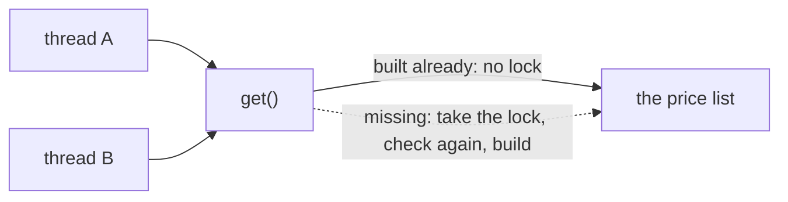

# Double-Checked Locking Pattern — Architecture Diagram

Threads ask for the price list. Only the first request builds it.

Mermaid source

```mermaid
flowchart LR
    T1["thread A"] --> G["get()"]
    T2["thread B"] --> G
    G -->|built already: no lock| P["the price list"]
    G -.->|missing: take the lock, check again, build| P
```

