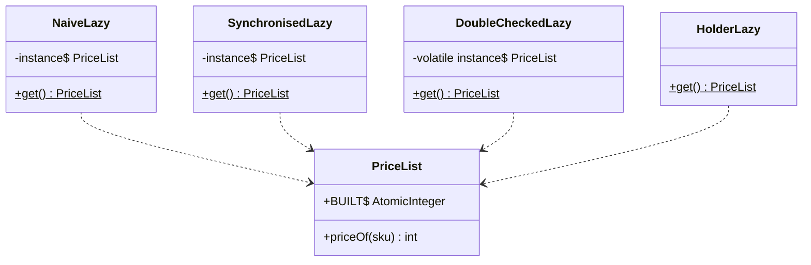

# Double-Checked Locking Pattern — Class Diagram

Four ways to get one lazily built price list.

Mermaid source

```mermaid
classDiagram
    class PriceList {
        +BUILT$ AtomicInteger
        +priceOf(sku) int
    }
    class NaiveLazy {
        -instance$ PriceList
        +get()$ PriceList
    }
    class SynchronisedLazy {
        -instance$ PriceList
        +get()$ PriceList
    }
    class DoubleCheckedLazy {
        -volatile instance$ PriceList
        +get()$ PriceList
    }
    class HolderLazy {
        +get()$ PriceList
    }
    NaiveLazy ..> PriceList
    SynchronisedLazy ..> PriceList
    DoubleCheckedLazy ..> PriceList
    HolderLazy ..> PriceList
```

