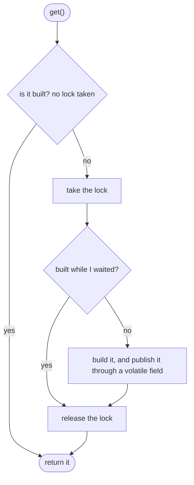

# Double-Checked Locking Pattern — Data Flow Diagram

What double-checked locking does.

Mermaid source

```mermaid
flowchart TD
    Get(["get()"])
    First{"is it built? no lock taken"}
    Have(["return it"])
    Lock["take the lock"]
    Second{"built while I waited?"}
    Build["build it, and publish it through a volatile field"]
    Free["release the lock"]
    Get --> First
    First -- yes --> Have
    First -- no --> Lock --> Second
    Second -- yes --> Free --> Have
    Second -- no --> Build --> Free
```

