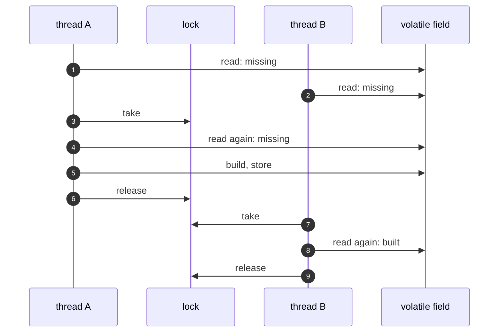

# Double-Checked Locking Pattern — Sequence Diagram

Written for a listener with the screen off.

Say it in words. Thread A and thread B both ask for the price list, and both see that it is missing. Thread A takes the lock, looks again, finds nothing, builds the price list, stores it in the volatile field and releases the lock. Thread B then gets the lock, looks again, and finds the price list already there, so it does not build one. Both threads have the same price list, and it was built once.

Mermaid source

The load-bearing sentence: **the second check is what stops the second build.**
