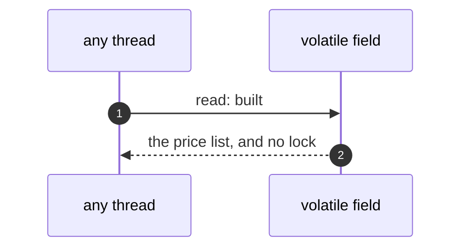

# Double-Checked Locking Pattern — UML Sequence Diagrams

Four sequences.

## 1. After It Is Built

Mermaid source

```mermaid
sequenceDiagram
    autonumber
    participant T as any thread
    participant F as volatile field
    T->>F: read: built
    F-->>T: the price list, and no lock
```

