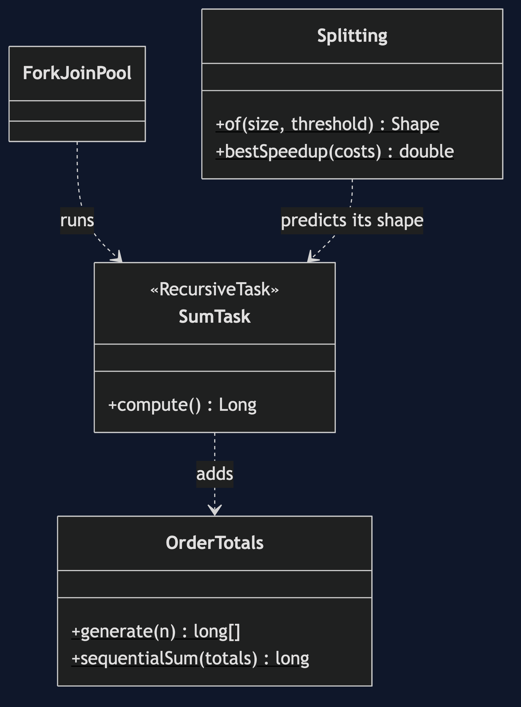
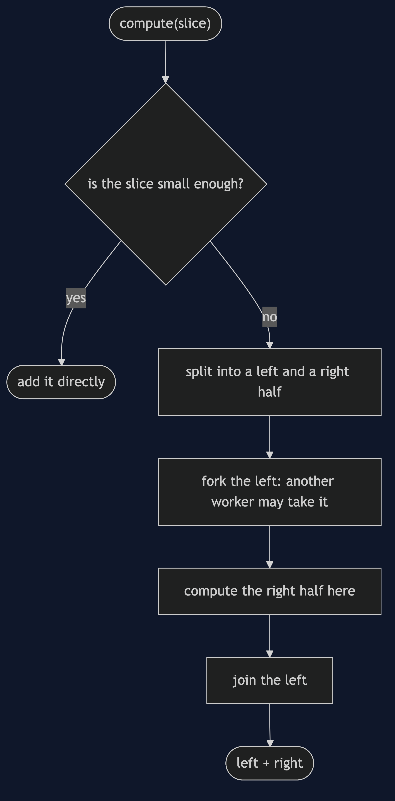

# Fork-Join Pattern

```
src/main/java/com/jk/explore/forkjoin/
├── ForkJoinDemo.java                the six acts
├── SumTask.java                     a RecursiveTask: add directly if small, else fork and join
├── Splitting.java                   the shape of the split, and the ceiling on speedup, with no threads
├── OrderTotals.java  Gate.java
```

**Fork-join splits a job until it is small, runs the pieces together, and joins the answers.**

This project is in [concurrency-design-patterns](..). It is the divide-and-conquer partner of [Thread Pool](../thread-pool-pattern), and it is what parallel streams use underneath.

## Run

```bash
./gradlew run
```

Six acts. Every number quoted below comes from this program's own output.

```
ONE. One loop.
  adding up 100000 order totals in a loop: 499838000 pence, on one thread.
TWO. Split it until it is small.
  split in halves until a piece is 10000 or fewer: 16 pieces added directly, 31 tasks in all.
  the total: 499838000, which is the same as the loop: true.
THREE. The pieces really run together.
  a pool of 4 workers, 16 pieces, each held until 4 are running at once. most running at the same moment: 4.
FOUR. How small is small enough.
  a piece of 100000 or fewer is added directly: 1 pieces, 1 tasks.
  a piece of 10000 or fewer is added directly: 16 pieces, 31 tasks.
  a piece of 100 or fewer is added directly: 1024 pieces, 2047 tasks.
  a piece of 1 or fewer is added directly: 100000 pieces, 199999 tasks.
  one piece is just the loop. one task for every item is mostly the cost of making tasks.
FIVE. Pieces that are not the same size.
  four pieces of work, costs [25, 25, 25, 25]: the best possible speedup on 4 workers is 4.0 times.
  costs [85, 5, 5, 5]: 1.18 times. the job waits for the big piece, and three workers wait for it too.
SIX. The bill.
  a pool of 2 workers and 8 pieces that each wait on something slow, such as a database: most running at once: 2 of 8.
  fork-join is for work that uses the processor. a worker that waits is a worker that cannot help.
  and for 20 items, split to single items: 39 tasks to add up 20 numbers. small jobs are faster in a loop.
```

## Test

```bash
./gradlew test
```

2 test classes, 8 test methods, offline, with nothing installed and no framework.

## Technologies and versions

| What | Version | Why it is here |
| --- | --- | --- |
| Java | 21 | The repository standard, via the Gradle toolchain block |
| Gradle | 9.2.1 | The wrapper in this directory; no separate install needed |
| JUnit 5 | 5.10.2 | Test runner |

No framework. A hand-built project stays plain Java so the mechanism is the whole lesson.

## Learning Material

| Document | What it covers |
| --- | --- |
| [`docs/problem-statement.md`](docs/problem-statement.md) | The scenario, and the problem |
| [`docs/fork-join-pattern-explained.md`](docs/fork-join-pattern-explained.md) | The pattern, and six acts |
| [`docs/class-diagram.md`](docs/class-diagram.md) | The types |
| [`docs/architecture-diagram.md`](docs/architecture-diagram.md) | The parts and how they connect |
| [`docs/data-flow-diagram.md`](docs/data-flow-diagram.md) | What happens to one request |
| [`docs/sequence-diagram.md`](docs/sequence-diagram.md) | Written for a listener with the screen off |
| [`docs/uml-diagram.md`](docs/uml-diagram.md) | Four sequences |
| [`docs/animation.html`](docs/animation.html) | The six acts in a browser |
| [`docs/prerequisites.md`](docs/prerequisites.md) | What you need to know |
| [`docs/session.md`](docs/session.md) | A one-hour taught session |
| [`docs/spec.md`](docs/spec.md) | The generated specification |
| [`docs/youtube.md`](docs/youtube.md) | Title, description and chapters |

### The pattern in one picture



### Where each piece sits


### How one request moves



### Who calls whom, in order


### All four sequences


### Video

Built from [`video/scenes.py`](video/scenes.py) by
[`video/build_video.sh`](video/build_video.sh). The rendered file is not
committed; see the repository README for why.

## Where you have already met this

Java's parallel streams and `Arrays.parallelSort`, and merge sort taught in every algorithms class.

## When this is too much

For small jobs, or work that waits on I/O, fork-join is overhead or starvation. A plain loop, or a thread pool sized for waiting, is better.

## Where this sits

This project is in [`concurrency-design-patterns`](..), and is meant to be read with its neighbours there.
