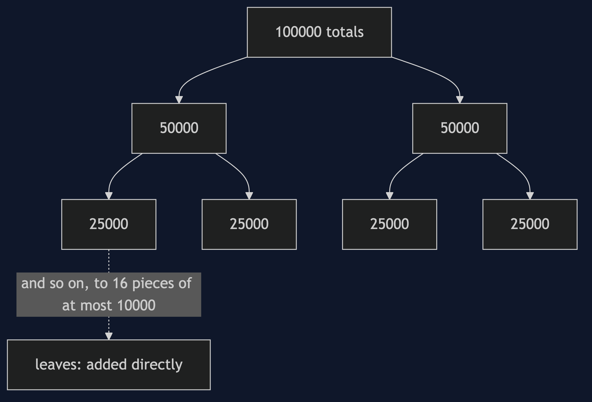
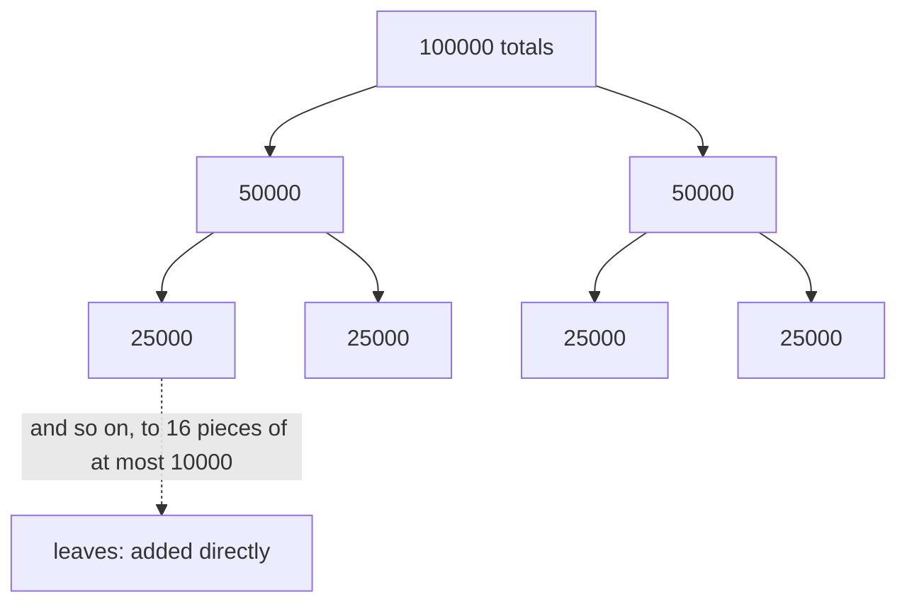

# Fork-Join Pattern — Architecture Diagram

The job splits into a tree of tasks, and the answers join back up.

Mermaid source

```mermaid
flowchart TD
    R["100000 totals"] --> A["50000"]
    R --> B["50000"]
    A --> A1["25000"]
    A --> A2["25000"]
    B --> B1["25000"]
    B --> B2["25000"]
    A1 -.->|and so on, to 16 pieces of at most 10000| L["leaves: added directly"]
```

