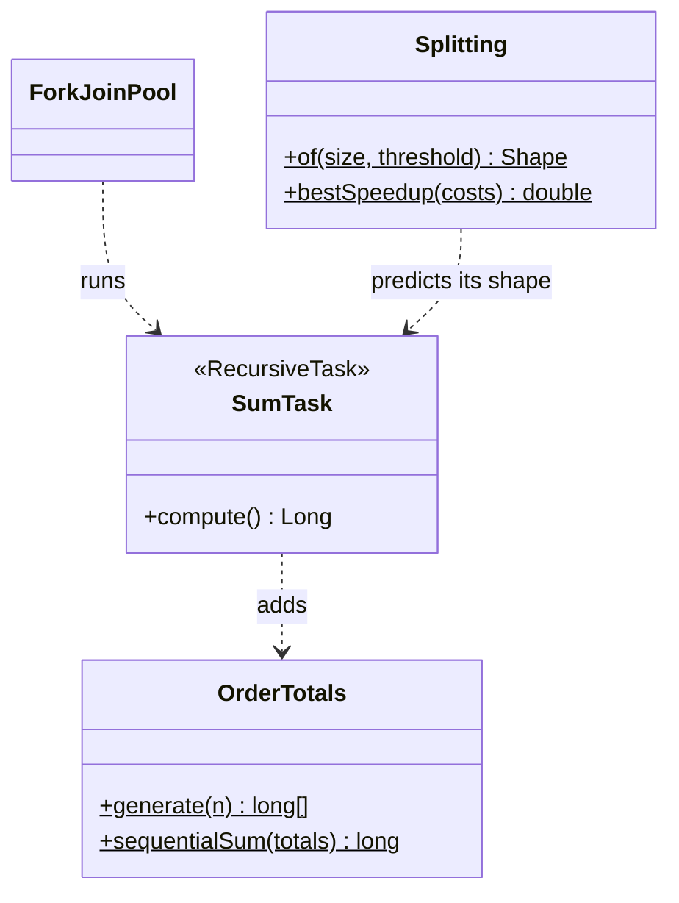

# Fork-Join Pattern — Class Diagram

A task that adds a slice directly, or splits in two.

Mermaid source

```mermaid
classDiagram
    class SumTask {
        <<RecursiveTask>>
        +compute() Long
    }
    class Splitting {
        +of(size, threshold)$ Shape
        +bestSpeedup(costs)$ double
    }
    class OrderTotals {
        +generate(n)$ long[]
        +sequentialSum(totals)$ long
    }
    class ForkJoinPool
    SumTask ..> OrderTotals : adds
    ForkJoinPool ..> SumTask : runs
    Splitting ..> SumTask : predicts its shape
```

