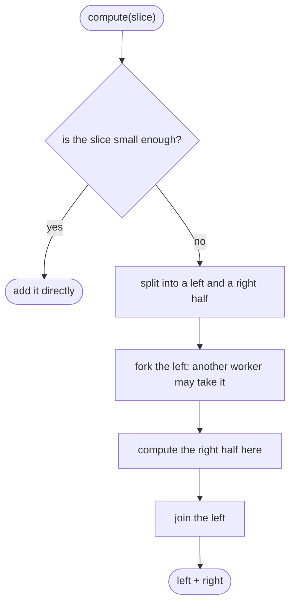

# Fork-Join Pattern — Data Flow Diagram

What compute() does.

Mermaid source

```mermaid
flowchart TD
    C(["compute(slice)"])
    Small{"is the slice small enough?"}
    Add(["add it directly"])
    Split["split into a left and a right half"]
    Fork["fork the left: another worker may take it"]
    Mine["compute the right half here"]
    Join["join the left"]
    Sum(["left + right"])
    C --> Small
    Small -- yes --> Add
    Small -- no --> Split --> Fork --> Mine --> Join --> Sum
```

