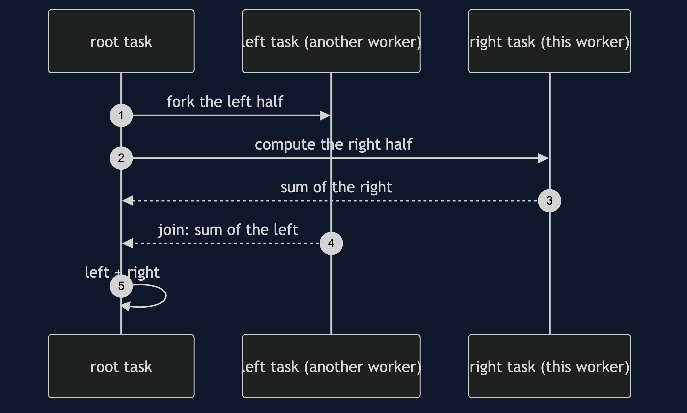
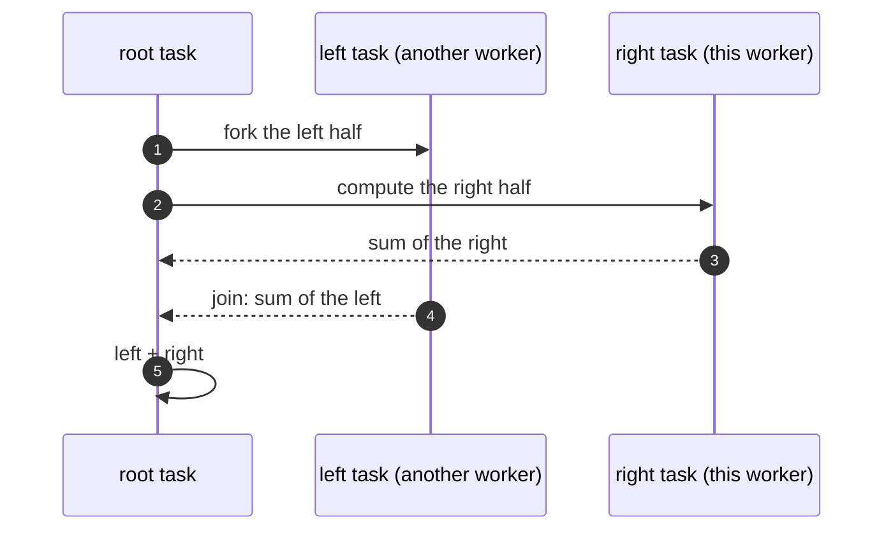

# Fork-Join Pattern — Sequence Diagram

Written for a listener with the screen off.

Say it in words. The root task is asked for the sum of a hundred thousand totals. It is too big, so it makes a left task and a right task. It forks the left, which another worker may pick up, and computes the right itself. The right splits again in the same way. Eventually a piece is small enough, and is added directly. Each task then joins its left half, adds the two answers, and returns the sum to its parent, until the root has the total.

Mermaid source

The load-bearing sentence: **each task forks one half, does the other, then joins.**
