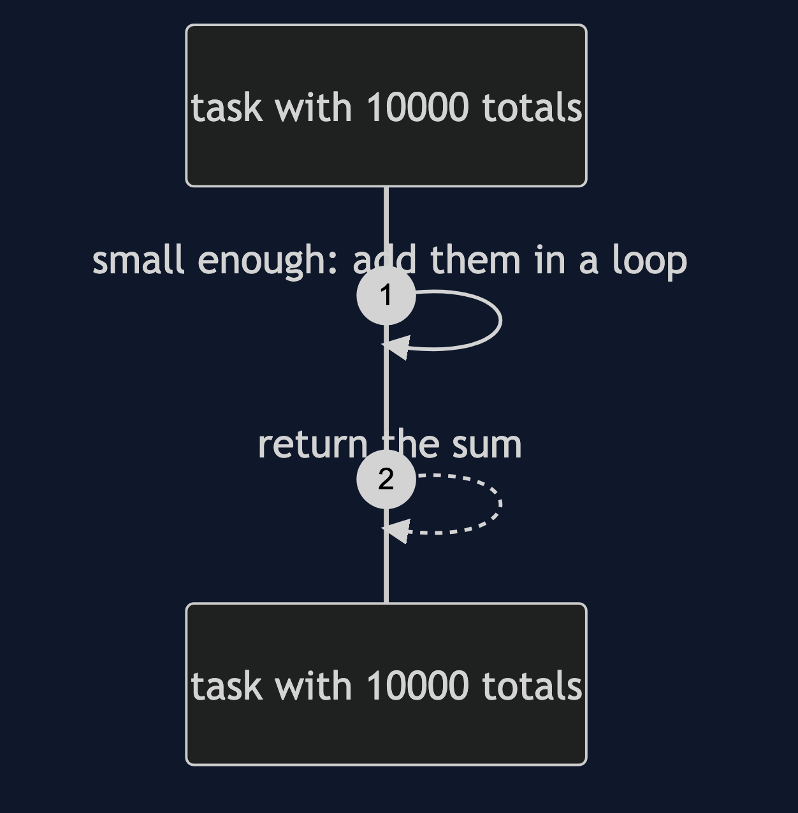
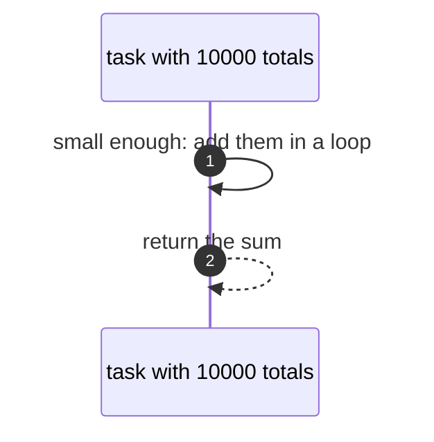

# Fork-Join Pattern — UML Sequence Diagrams

Four sequences.

## 1. A Leaf

Mermaid source

```mermaid
sequenceDiagram
    autonumber
    participant T as task with 10000 totals
    T->>T: small enough: add them in a loop
    T-->>T: return the sum
```

