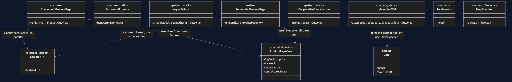
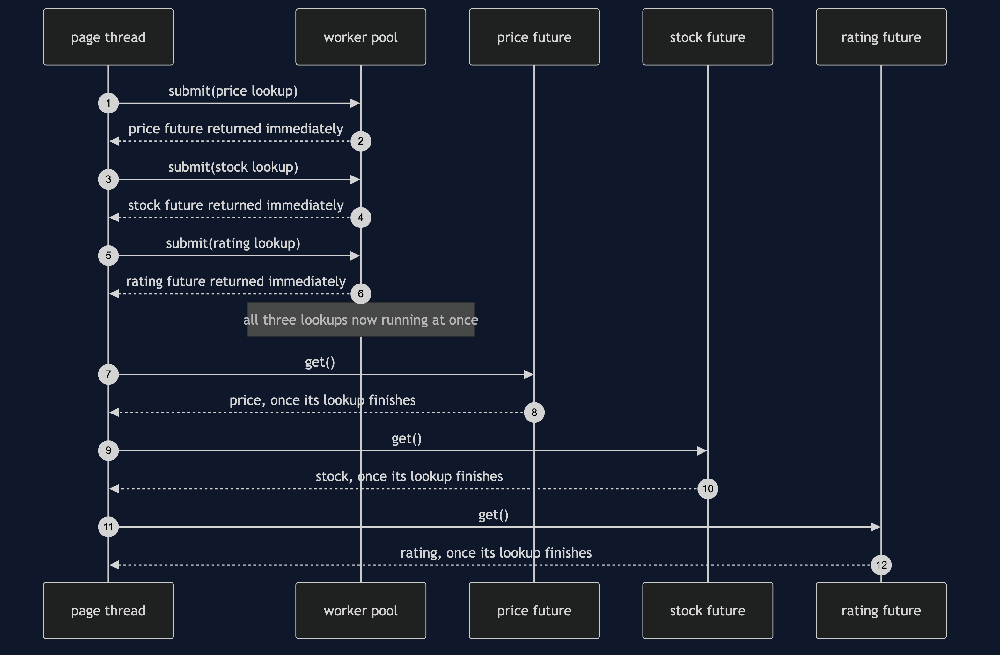
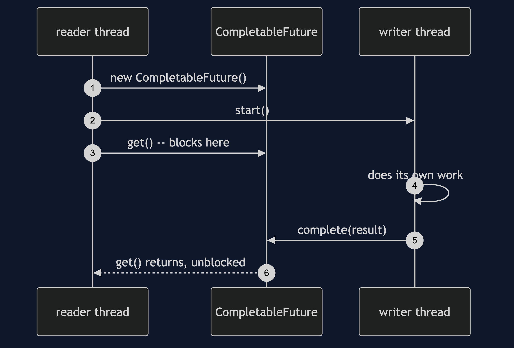
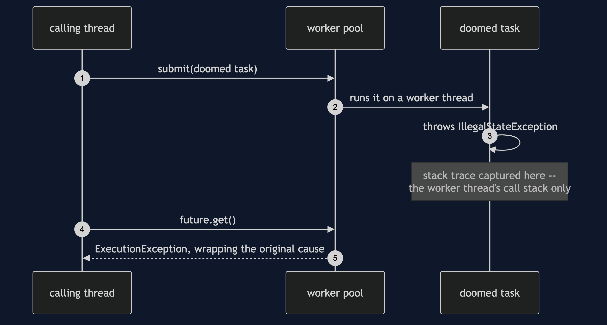

# Future/Promise Pattern

```
src/main/java/com/jk/explore/futurepromise/
├── ProductPageDemo.java              composition root — the six acts
│
├── domain/
│   ├── Lookup.java                    «functional interface» fetch(sku)
│   └── ProductPageView.java           record(price, stock, rating, elapsedNanos)
├── harness/                          ← reused unchanged from §46
│   ├── Gate.java
│   ├── Rendezvous.java
│   └── StepExecutor.java
├── naive/
│   └── SequentialProductPage.java     three lookups, one after another
│
└── pattern/                          ← the real thing
    ├── ConcurrentProductPage.java     three lookups, submitted at once
    ├── FutureAndPromise.java          the two halves, made explicit
    ├── AsyncFailure.java              exceptions move
    ├── UnboundedWait.java             get() with no timeout is a hang
    └── CooperativeCancellation.java   cancel() is a request, not a command
```

**Each unit of work is submitted and immediately returns a handle to a
result that does not exist yet, so independent work can run at once
instead of one call waiting out the last before it even starts.**

This is the third project in
[concurrency-design-patterns](..), reusing
[Producer–Consumer](../producer-consumer-pattern)'s harness directly, and
answering a question the first two projects leave open: once work is
handed to a queue or a pool, how does the caller ever find out what
happened.

## Run

```bash
./gradlew run
```

Six acts.

Act one is three independent lookups, paid for one after another anyway.

```
ONE. Sequential — price, then stock, then rating.
  price £129.99, stock 7, rating 4.6
  rendered in 619ms — three lookups, none depending on the others,
  paid for one after another anyway.
```

Act two is the same three lookups, submitted at once.

```
TWO. Concurrent — all three submitted at once.
  price £129.99, stock 7, rating 4.6
  rendered in 208ms — roughly one lookup's cost, not three.
```

Act three makes the Future/Promise split explicit, on two threads.

```
THREE. Future and Promise — the two halves, made explicit.
  the writer thread completed the promise: £129.99
  the reader thread was blocked on the future until it did.
```

Act four shows exceptions moving — surfacing later, wrapped, on a stack
trace that omits the calling thread entirely.

```
FOUR. Exceptions move — surfacing wrapped, on get().
  cause: catalogue unavailable for ESP-001
  stack top: com.jk.explore.futurepromise.ProductPageDemo.lambda$actFour$4(ProductPageDemo.java:107)
  the call site that submitted this task appears nowhere above: true
```

Act five shows a `get()` with no timeout for what it actually is.

```
FIVE. get() with no timeout is a hang.
  a task parked forever, waited on with a 200ms rescue timeout:
  timed out: true, after 205ms
  a bare get() with no timeout does not time out — it just never returns.
```

Act six shows cancellation for what it actually is: a request.

```
SIX. Cancellation is cooperative, and may do nothing.
  cancel(true) reported: true
  the task ran to completion anyway: true
  it caught every interrupt and carried on — cancel asked; the task said no.
```

## Test

```bash
./gradlew test
```

Eight test classes, 10 test methods between them, several run twenty
times each via `@RepeatedTest` — 124 executions total, zero of them using
`Thread.sleep` to wait for another thread. `ConcurrentProductPageTest`
proves all three lookups are genuinely in flight at once, not merely
submitted quickly; `CooperativeCancellationTest` proves cancellation is
requested only after the task has actually started, so the test cannot
accidentally prove the wrong thing by cancelling before the task even
runs.

## Technologies and versions

| What | Version | Why it is here |
| --- | --- | --- |
| Java | 21 | The repository standard, via the Gradle toolchain block |
| Gradle | 9.2.1 | The wrapper in this directory; no separate install needed |
| JUnit 5 | 5.10.2 | Test runner — `@RepeatedTest` is how this project proves a race, not merely exercises it |

No frameworks beyond JUnit. `java.util.concurrent` is this category's
entire subject, including `CompletableFuture`, `Future` and
`ExecutorService` — the pattern classes wrap them directly.

## Learning Material

| Document | What it covers |
| --- | --- |
| [`docs/problem-statement.md`](docs/problem-statement.md) | The three independent lookups, and what the pattern has to deliver |
| [`docs/future-promise-pattern-explained.md`](docs/future-promise-pattern-explained.md) | The two halves, and the three costs paid honestly |
| [`docs/determinism.md`](docs/determinism.md) | How each scenario is forced, and the two that need no forcing at all |
| [`docs/class-diagram.md`](docs/class-diagram.md) | The types, and which ones touch `CompletableFuture` directly |
| [`docs/architecture-diagram.md`](docs/architecture-diagram.md) | Where each piece runs, and the Future/Promise handoff |
| [`docs/data-flow-diagram.md`](docs/data-flow-diagram.md) | One render, to an assembled view, a wrapped exception, or a rescued hang |
| [`docs/sequence-diagram.md`](docs/sequence-diagram.md) | Who calls whom, in order — written for a listener with the screen off |
| [`docs/uml-diagram.md`](docs/uml-diagram.md) | Four sequences: concurrent lookups, the handoff, a moved exception, the harness's own proof |
| [`docs/animation.html`](docs/animation.html) | The six acts in a browser |
| [`docs/prerequisites.md`](docs/prerequisites.md) | What you need to know, including what §46/§47 already covered |
| [`docs/session.md`](docs/session.md) | A one-hour taught session with exercises |
| [`docs/spec.md`](docs/spec.md) | The generated specification, with measured test counts and timings |
| [`docs/youtube.md`](docs/youtube.md) | Title, description and chapters for the video |

### The pattern in one picture

The single most important thing on this diagram: `FutureAndPromise` is
the only class that touches a `CompletableFuture` directly — every other
pattern class works through the plain `Future` an `ExecutorService`
already returns.



### Where each piece runs

Three lookups submitted at once, and the Future/Promise handoff kept
deliberately separate from the pool — the split does not need an
executor at all.


### How one render moves

One render, to an assembled view — or to a wrapped exception, or to a
rescued hang, both shapes of the same underlying fact: a task the caller
could not simply wait out.


### Who calls whom, in order

The sequence written to work with the screen off: the page thread submits
all three lookups before asking any of them for a result, because asking
early would not make any lookup start sooner.



### All four sequences

The full set from [`docs/uml-diagram.md`](docs/uml-diagram.md).

**One. Three lookups, submitted at once, read in order.**


**Two. Future and Promise — one object, two threads.** The reader blocks
in `get()`; the writer, elsewhere, calls `complete()`.



**Three. An exception surfaces later, wrapped.** The stack trace captured
at the throw belongs entirely to the worker thread.



**Four. The harness's own proof — a lost update, every run.** The same
mechanism §46 built, proven again before this project's own acts rely on
it.


### Video

The narrated walkthrough is built from
[`video/scenes.py`](video/scenes.py) by
[`video/build_video.sh`](video/build_video.sh). The rendered file is not
committed — see the repository README for why.

## When this is too much

Worth it the moment two or more units of work are genuinely independent
and each takes real, measurable time — exactly this project's three
catalogue lookups. Not worth it for two calls that are already fast, or
for two calls where the second genuinely needs the first's result; a
`Future` around work that was never going to run concurrently with
anything is ceremony with no payoff behind it.

## Where this sits

This is the third of six projects in
[`concurrency-design-patterns`](..), reusing §46's harness directly and
assuming a reader has met either §46 or §47 already.

The next project, **Read–Write Lock**, moves from getting an answer back
to protecting the shared state an answer is often read from: the
category's stock count, this time under a read-heavy load.
