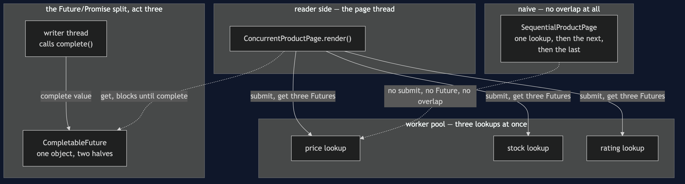
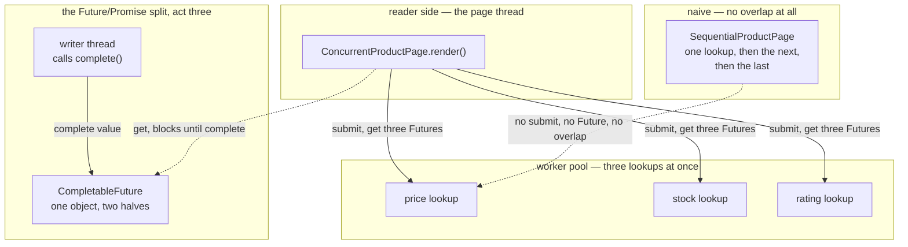

# Future/Promise Pattern — Architecture Diagram

Where each piece runs, and the one object that stands between a reader
and a writer that may never otherwise meet.

Mermaid source

## Reading The Diagram

**Three arrows leave `Page` in the pattern half, all at once.** That
simultaneity is the entire pattern: three submissions, in immediate
succession, each returning before any lookup has finished.

**The `Handoff` box is deliberately separate from the pool.** `Future`
and `Promise` do not require an executor at all — `FutureAndPromise`
spawns one plain thread — because the split between reading and writing a
result is a property of `CompletableFuture` itself, not of thread pools.
