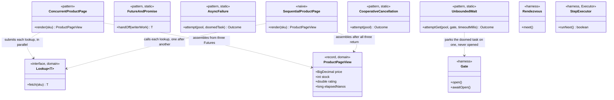

# Future/Promise Pattern — Class Diagram

The single most important thing on this diagram: `FutureAndPromise` is the
only class that touches a `CompletableFuture` directly — every other
pattern class works through the plain `Future` returned by
`ExecutorService.submit`, because the reader/writer split is this
project's own lesson, not something every future-using class needs to
know about.

Mermaid source

## Reading The Diagram

**`ConcurrentProductPage` and `SequentialProductPage` share every
dependency except one another.** Both take the same three `Lookup`
instances and produce the same `ProductPageView`; the only difference the
diagram cannot show directly is *when* each lookup's call happens
relative to the others — which is exactly the point [`sequence-diagram.md`](sequence-diagram.md)
exists to carry instead.

**Three classes have no relationship to `Lookup` or `ProductPageView` at
all.** `AsyncFailure`, `UnboundedWait` and `CooperativeCancellation` are
not about the product page — they are static demonstrations about
`Future` itself, each proving one honest cost the pattern does not
advertise on its own.
