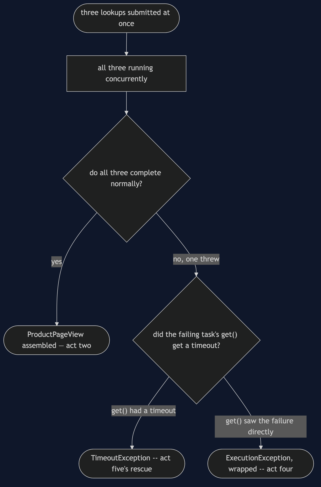
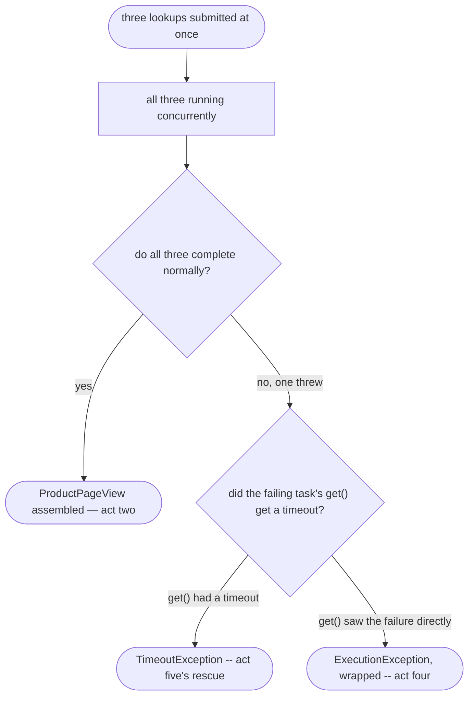

# Future/Promise Pattern — Data Flow Diagram

One product page render, from three submissions to one assembled view —
or to a wrapped exception, or to a rescued hang.

Mermaid source

## Reading The Diagram

**`Running` has exactly one arrow leaving it toward a decision, not three
separate paths per lookup.** The page does not ask "did price succeed?"
and "did stock succeed?" independently — it calls `get()` on each Future
in turn, and the first one that surfaces a problem determines what
happens next, exactly the way act four's single doomed task does.

**`TimedOut` and `Wrapped` are two different shapes of the same
underlying fact: a task the caller could not simply wait out.** One
never finished; nothing else it demonstrates is different. The other
finished quickly, badly. Both leave the reader without the value it
asked for, for reasons that have nothing to do with the value itself.
