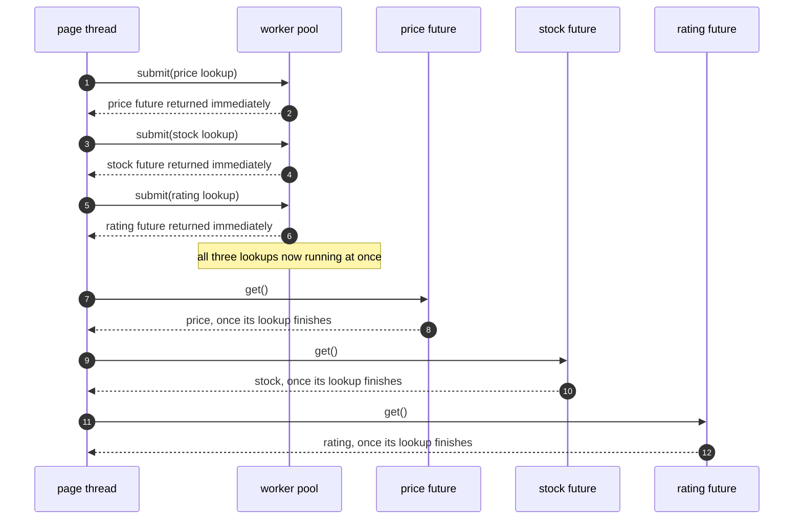

# Future/Promise Pattern — Sequence Diagram

Written for a listener with the screen off: who calls whom, and in what
order, when three independent lookups run at once instead of one after
another.

Say it in words. The page thread submits the price lookup to the pool,
and immediately — without waiting for it to finish — submits the stock
lookup, and immediately submits the rating lookup. All three are now
running, genuinely at the same time, on separate worker threads. Only
after all three have been submitted does the page thread ask each one, in
turn, for its result: first the price future, then the stock future,
then the rating future. Because all three lookups have been running
since the very first submission, the total wait is roughly however long
the slowest single lookup takes — not the three lookups added together.

Mermaid source

Say the load-bearing sentence aloud, because it is the one a picture
cannot carry on its own: **the page thread never asks a future for its
value until after every lookup has already been submitted — asking early
would not make any lookup start sooner, because each one started the
moment it was submitted, not the moment somebody asked for its result.**

For the Future/Promise handoff, the exceptions that move, and the two
ways `get()` can betray you, see [`uml-diagram.md`](uml-diagram.md).
