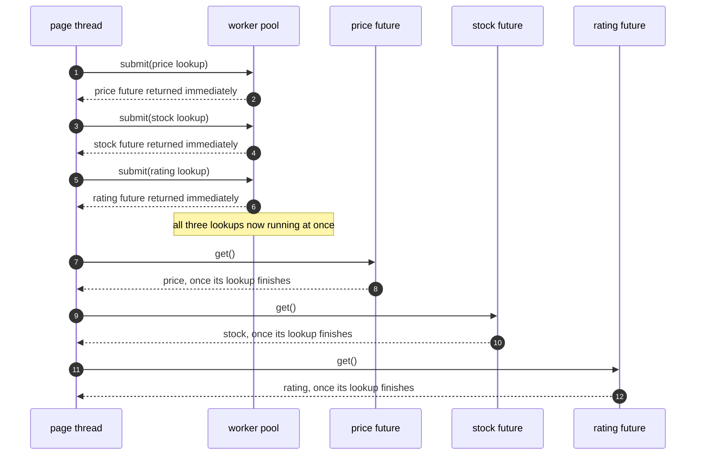
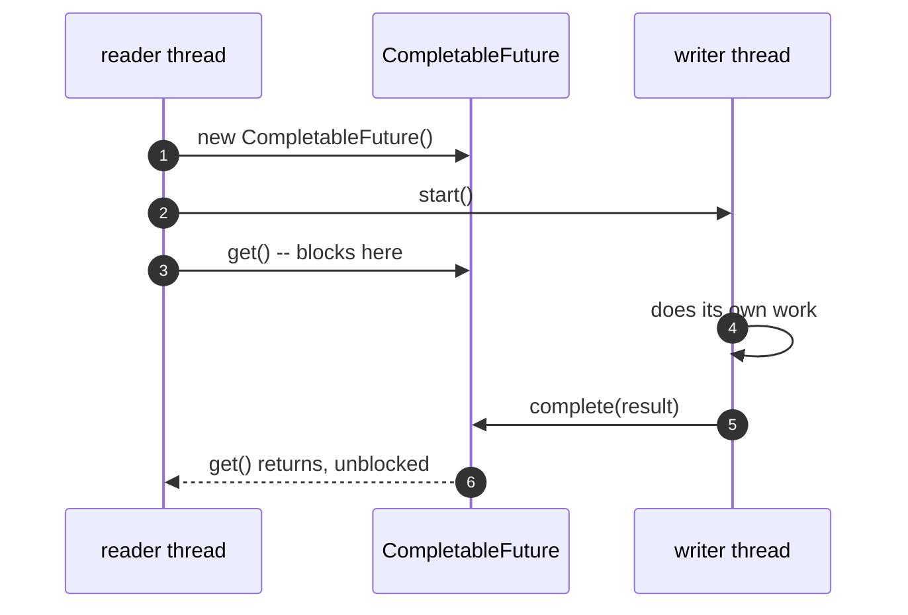
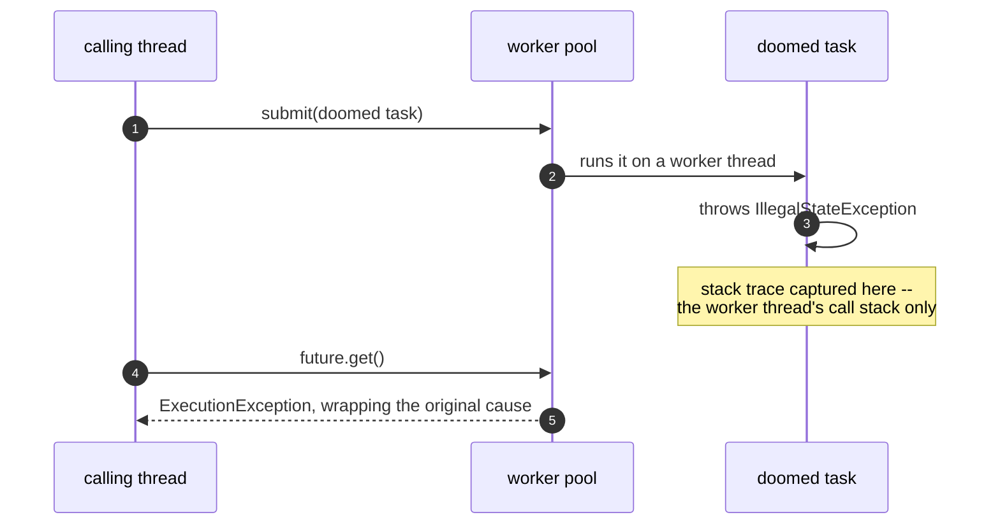
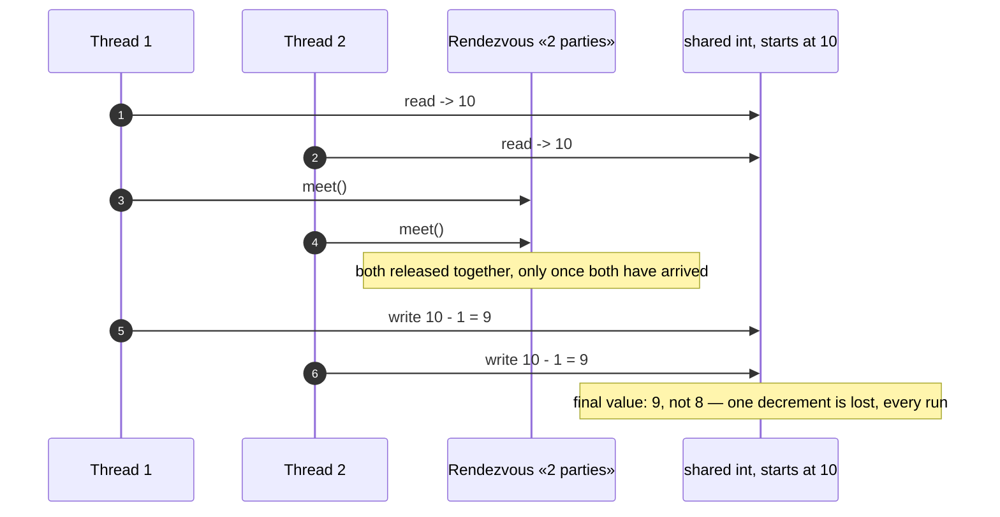

# Future/Promise Pattern — UML Sequence Diagrams

Four sequences: three lookups running at once, the Future/Promise
handoff, an exception surfacing wrapped, and the harness's own
lost-update proof, copied unchanged from §46.

## 1. Three Lookups, Submitted At Once, Read In Order

Mermaid source

## 2. Future And Promise — One Object, Two Threads

Mermaid source

## 3. An Exception Surfaces Later, Wrapped

Mermaid source

## 4. The Harness's Own Proof — A Lost Update, Every Run

Mermaid source

This is the same mechanism §46 built and this project's `HarnessSelfTest`
proves again, copied unchanged, before act two or act three relies on it.
