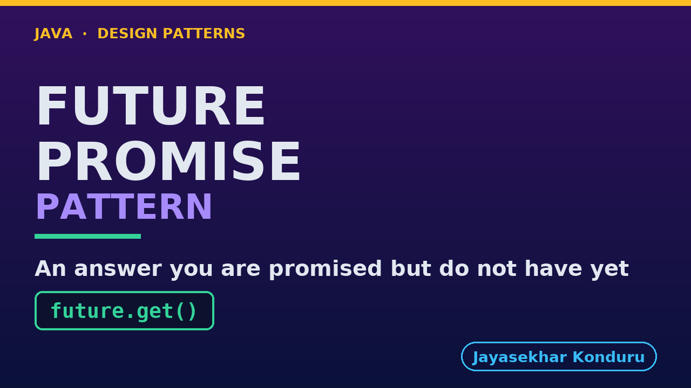

# YouTube — Future Promise Pattern

Everything needed to publish `video/future-promise-pattern-explained.mp4`. Copy the fields straight out of this file.

Chapter timings are generated from the video's `.srt`. Re-run `python3 docs/make_youtube_docs.py future-promise` after any change to the narration, or they will be wrong.

## Title

```
Future and Promise in Java - The Answer You Don't Have Yet
```

58 characters — under the 60 YouTube shows before truncating in search results.

## Description

The first two lines are what a viewer sees above the fold, so they carry the hook rather than the boilerplate.

```
Learn the Future and Promise pattern in Java with an online store product page that needs three separate lookups. Starting a piece of work hands you a future straight away, a handle to a result that does not exist yet, so independent lookups run at the same time instead of one after another, like the buzzer a coffee shop gives you. We separate the reader's half from the writer's half, hear an error reported far from the line that caused it, see why get with no timeout is a hang and why cancelling is only a request, and finish with the bill. A future promises when a value will be ready, never that the work can be stopped.

CHAPTERS
00:00 Introduction
00:55 The Scenario
01:21 Naive — Sequential Lookups
01:41 The Pattern — Concurrent Lookups
02:02 The Two Halves Beginners Conflate
02:33 Future And Promise, Made Explicit
03:02 Exceptions Move
03:33 get() With No Timeout Is A Hang
04:04 Cancellation Is Cooperative
04:31 One More Cost: Chained Callbacks
04:58 The Same Harness, Proven Again
05:30 What The Scheduler Really Does
05:55 The Bill
06:21 When This Is Too Much
06:41 Thanks for Watching

SOURCE CODE, WRITTEN NOTES AND AN INTERACTIVE ANIMATION
https://github.com/jk-boot-up/java-design-patterns/tree/main/gradle-java/concurrency-design-patterns/future-promise-pattern

WHAT YOU NEED FIRST
Java 21 and a working knowledge of classes and interfaces. No prior design-pattern knowledge is assumed. The full prerequisites are in docs/prerequisites.md in the repository.
```

## Chapters

YouTube renders these as chapters only if there are at least three and the first is at `00:00`.

```
00:00 Introduction
00:55 The Scenario
01:21 Naive — Sequential Lookups
01:41 The Pattern — Concurrent Lookups
02:02 The Two Halves Beginners Conflate
02:33 Future And Promise, Made Explicit
03:02 Exceptions Move
03:33 get() With No Timeout Is A Hang
04:04 Cancellation Is Cooperative
04:31 One More Cost: Chained Callbacks
04:58 The Same Harness, Proven Again
05:30 What The Scheduler Really Does
05:55 The Bill
06:21 When This Is Too Much
06:41 Thanks for Watching
```

## Tags

```
future promise pattern, completablefuture, java async, design patterns, java design patterns, gang of four, java 21, software design, clean code, object oriented design, java tutorial, ecommerce, programming tutorial
```

216 characters, under YouTube's 500 limit.

## Thumbnail



**Upload `docs/thumbnail.png`** — 1280×720, the size YouTube recommends, generated by `docs/make_thumbnails.py`. It is deliberately not the same image as the video's opening frame: a thumbnail is judged at about 360 pixels wide in a search result, so this one carries only the pattern name, one line of promise and one short piece of code, each set large enough to survive the shrink.

`video/poster.png` is the 1920×1080 opening frame, produced by the video build. It stays in the repository as the title card; it is not what gets uploaded.

YouTube will not pick the thumbnail up on its own — upload it under **Details → Thumbnail → Upload file**. A custom thumbnail requires a verified channel.

## Upload checklist

- [ ] Upload `video/future-promise-pattern-explained.mp4` (1080p, H.264, 30 fps, AAC 48 kHz — already YouTube's recommended settings, no re-encode needed)
- [ ] Set the video language to **English** first, or the subtitle option may not appear
- [ ] Add subtitles: *Video elements → Add subtitles → Upload file → With timing* → `video/future-promise-pattern-explained.srt`
- [ ] Upload `docs/thumbnail.png` as the thumbnail — do not let YouTube auto-pick a frame
- [ ] Paste the title, description and tags from above
- [ ] Add to the **Java Design Patterns** playlist, in learning order
- [ ] Wait for 1080p processing before sharing the link — code slides are unreadable at 360p

## Cards and end screen

End screen links to whichever pattern video goes up next — set it at upload time rather than assuming an order.

Add a card partway through pointing at the playlist, so a viewer who arrives at this pattern from search can find the rest of the series.

## Runtime

Approximately 07:19, narrated at 145 words per minute.
