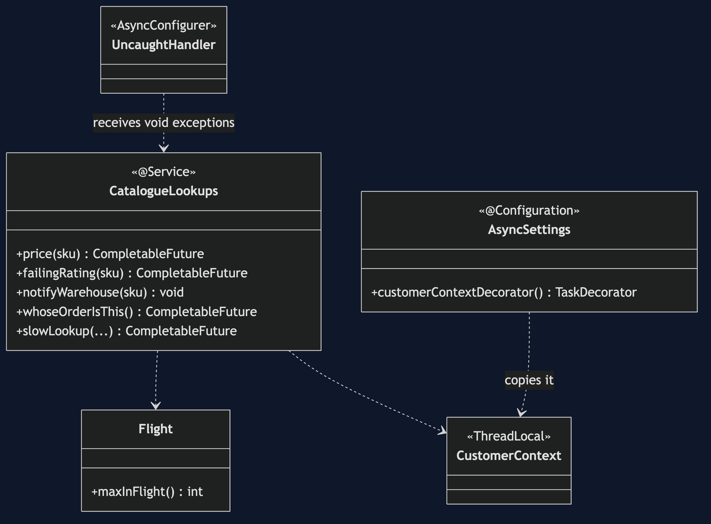
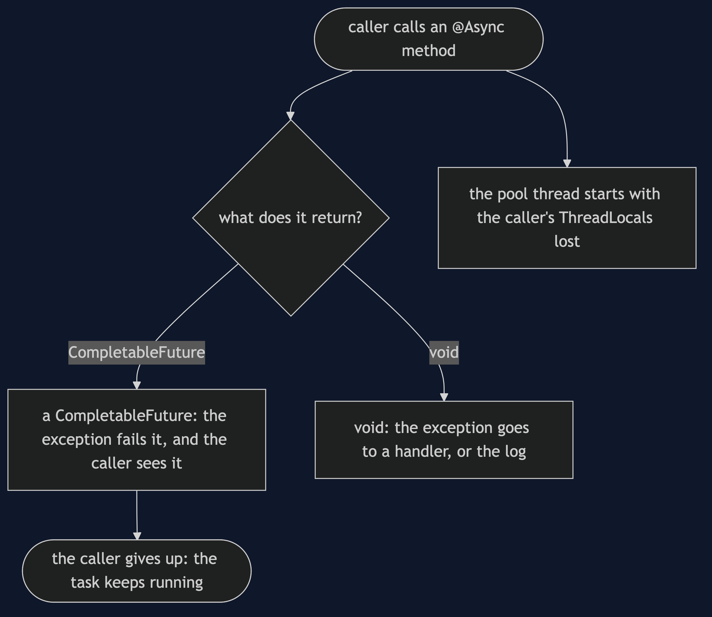
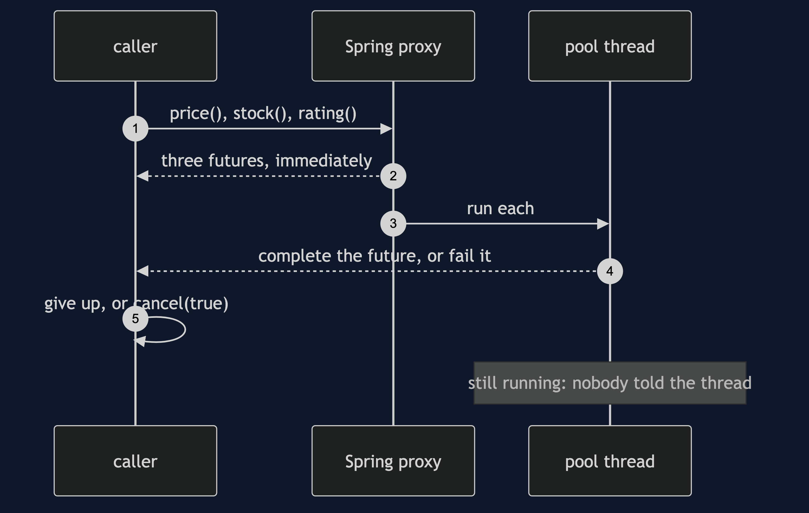
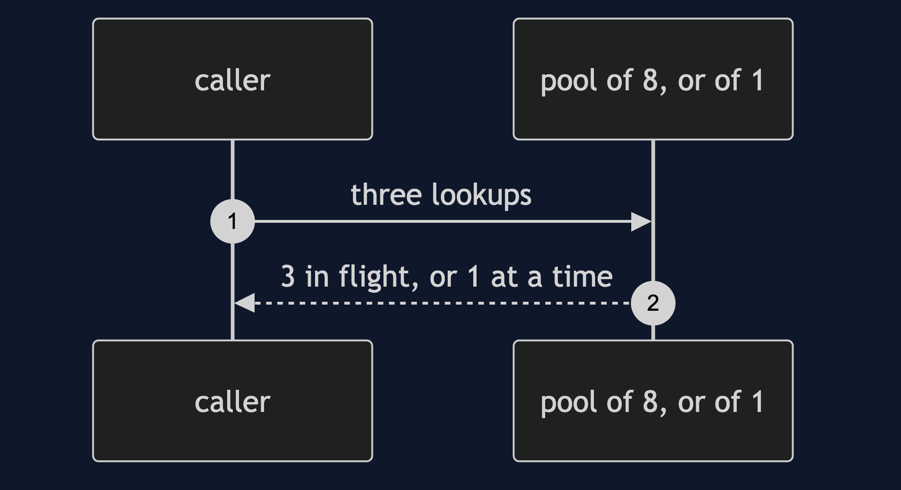
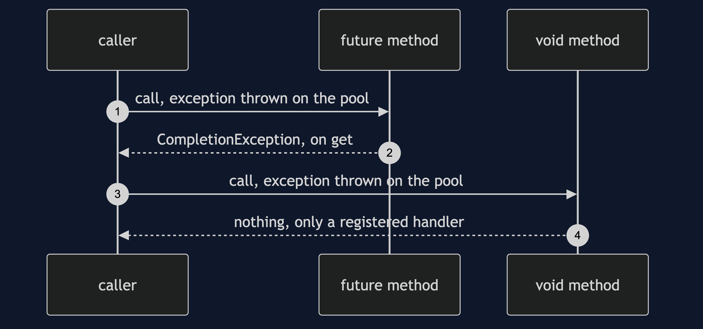
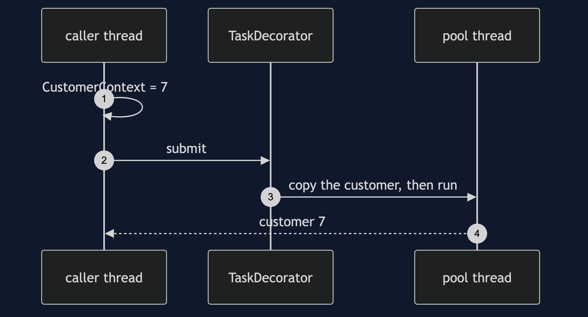
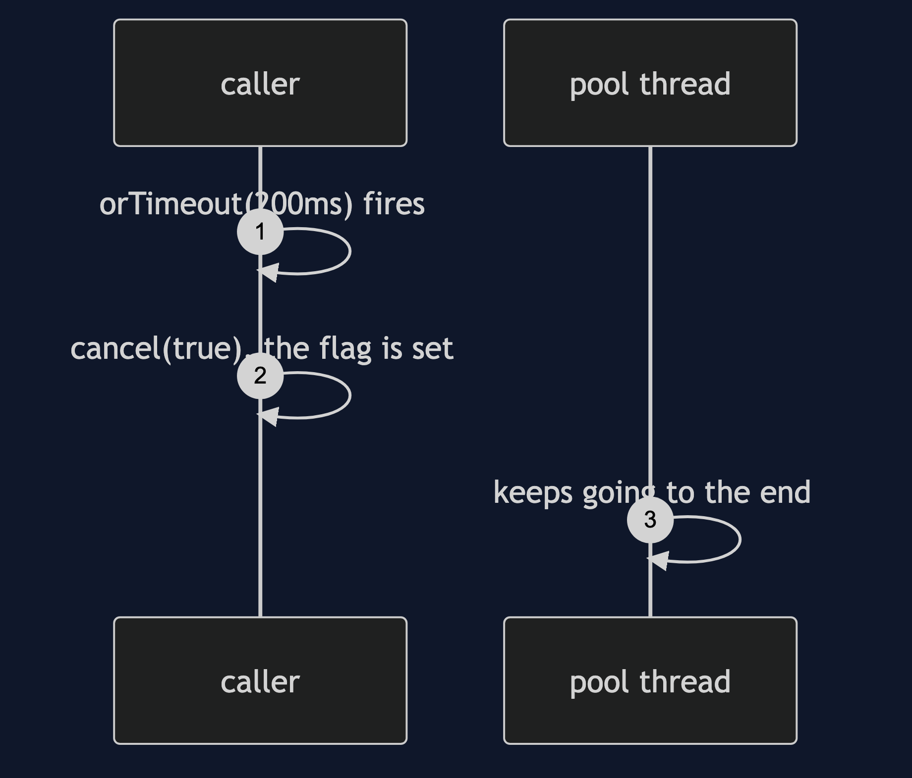

# Future/Promise with Spring Pattern

```
src/main/java/com/jk/explore/futurepromisespring/
├── ProductPageApplication.java      the Spring Boot entry point and the six acts
├── CatalogueLookups.java            @Async lookups, a void method, a context reader, a slow task
├── Flight.java  Gate.java           count lookups in flight, and hold them without sleeping
├── CustomerContext.java             a ThreadLocal, the way request and security context are held
├── AsyncSettings.java               the exception list, and the TaskDecorator that copies context
└── UncaughtHandler.java             the one place a void method's exception can go
```

**`@Async` returns a `CompletableFuture` that the container completes. It does not decide how concurrent that is, carry your context across, or stop the work when you give up.**

This project is the framework version of [Future/Promise](../future-promise-pattern). That project built the mechanism by hand. This one shows the same idea inside Spring Boot. It does not re-teach the pattern. It shows what Spring Boot adds, the failures that are its own, and what it costs.

## Run

```bash
./gradlew run
```

Six acts. The partner project, Future/Promise, built the mechanism by hand. Here the same idea runs through Spring Boot, and every count comes from real output.

```
FUTURE/PROMISE WITH SPRING — what @Async loses

ONE. @Async returns a future, and the pool decides how concurrent it is.
  three independent lookups, price, stock and rating, submitted at once.
  on the default pool, lookups in flight at the same moment: 3
  on a pool of one thread: 1
  the annotation asked for concurrency. the pool decided whether to give it.

TWO. Exceptions: a future carries them, a void method loses them.
  a method returning a future: the caller sees CompletionException, cause "the review service is down".
  the calling method appears in that stack trace: false. the trace belongs to a pool thread.
  a void method threw, and the caller got: nothing. the call returned normally.
  the only place it went is a handler you have to register: [notifyWarehouse: the warehouse feed rejected ESP-001]

THREE. Thread-locals do not cross the thread boundary.
  the caller is working for customer 7. the async method asked whose order it is: "customer null".
  request context, security context and logging context are all thread-locals, and are all gone.
  with a TaskDecorator that copies it across: "customer 7". the fix is a bean, and it is yours to write.

FOUR. A timeout is the caller giving up. The work does not stop.
  the caller waited 200ms and got: TimeoutException.
  the task had finished when the caller gave up: false.
  and then it ran to the end anyway, and did its work: true. nobody was waiting for the answer.

FIVE. cancel(true) on a CompletableFuture interrupts nothing.
  cancel(true) reported: true. isCancelled: true.
  the task ran to completion anyway: true. the flag was set on the future, and the thread was never told.

SIX. Composing the page, and one lookup failing.
  assembled from three futures, with no get() until the end: price £129.99, stock 7, rating 4.6
  with the review service down and a fallback chosen at that one step: price £129.99, stock 7, rating unavailable
  without the fallback, one failing lookup fails the whole page.
  verdict: return a CompletableFuture, never void; propagate context on purpose; and treat a timeout as giving up, not stopping.
  where you have met this: every @Async method that returns a CompletableFuture.
```

## Test

```bash
./gradlew test
```

2 test classes, 8 test methods, offline, with each Spring context started inside the test, and no server.

## Technologies and versions

| What | Version | Why it is here |
| --- | --- | --- |
| Java | 21 | The repository standard, via the Gradle toolchain block |
| Gradle | 9.2.1 | The wrapper in this directory; no separate install needed |
| Spring Boot | 4.1.1 | The container, `@Async` and `CompletableFuture` support |
| JUnit 5 | 5.10.2 | Test runner |

See [`docs/dependencies.md`](docs/dependencies.md).

## Learning Material

| Document | What it covers |
| --- | --- |
| [`docs/problem-statement.md`](docs/problem-statement.md) | The partner's product page, and what is new |
| [`docs/future-promise-with-spring-pattern-explained.md`](docs/future-promise-with-spring-pattern-explained.md) | What @Async returns, and the four things it loses |
| [`docs/class-diagram.md`](docs/class-diagram.md) | The types |
| [`docs/architecture-diagram.md`](docs/architecture-diagram.md) | A caller, a future, and Spring's pool |
| [`docs/data-flow-diagram.md`](docs/data-flow-diagram.md) | One @Async call: the future, the pool, and what is lost |
| [`docs/sequence-diagram.md`](docs/sequence-diagram.md) | Written for a listener with the screen off |
| [`docs/uml-diagram.md`](docs/uml-diagram.md) | Four sequences |
| [`docs/animation.html`](docs/animation.html) | The six acts in a browser |
| [`docs/prerequisites.md`](docs/prerequisites.md) | What you need to know |
| [`docs/session.md`](docs/session.md) | A one-hour taught session |
| [`docs/spec.md`](docs/spec.md) | The generated specification |
| [`docs/youtube.md`](docs/youtube.md) | Title, description and chapters |
| [`docs/dependencies.md`](docs/dependencies.md) | What Spring Boot is, what it costs, and that skipping this project loses none of the pattern |

### The pattern in one picture



### Where each piece sits


### How one request moves



### Who calls whom, in order



### All four sequences









### Video

Built from [`video/scenes.py`](video/scenes.py) by
[`video/build_video.sh`](video/build_video.sh). The rendered file is not
committed; see the repository README for why.

## Where you have already met this

Every `@Async` method that returns a `CompletableFuture`, and every log line that lost its request id on the way to a pool thread.

## When this is too much

For two lookups that are already fast, or where the second needs the first's result, a future around work that never overlaps is ceremony.

## Where this sits

This project pairs with [Future/Promise](../future-promise-pattern), and is a framework version in [`concurrency-design-patterns`](..).
