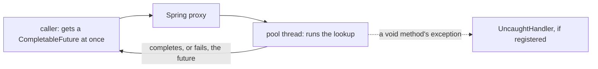

# Future/Promise with Spring Pattern — Architecture Diagram

The caller holds a future. Spring's pool runs the method and completes it.

Mermaid source

```mermaid
flowchart LR
    C["caller: gets a CompletableFuture at once"] --> P["Spring proxy"]
    P --> Pool["pool thread: runs the lookup"]
    Pool -->|completes, or fails, the future| C
    Pool -.->|a void method's exception| H["UncaughtHandler, if registered"]
```

