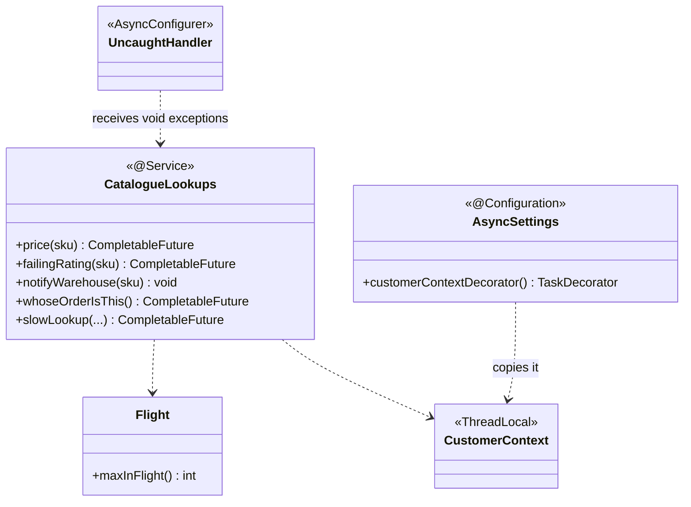

# Future/Promise with Spring Pattern — Class Diagram

`CatalogueLookups` returns futures. `UncaughtHandler` and `AsyncSettings` catch what a caller cannot.

Mermaid source

```mermaid
classDiagram
    class CatalogueLookups {
        <<@Service>>
        +price(sku) CompletableFuture
        +failingRating(sku) CompletableFuture
        +notifyWarehouse(sku) void
        +whoseOrderIsThis() CompletableFuture
        +slowLookup(...) CompletableFuture
    }
    class UncaughtHandler {
        <<AsyncConfigurer>>
    }
    class AsyncSettings {
        <<@Configuration>>
        +customerContextDecorator() TaskDecorator
    }
    class CustomerContext {
        <<ThreadLocal>>
    }
    class Flight {
        +maxInFlight() int
    }
    CatalogueLookups ..> Flight
    CatalogueLookups ..> CustomerContext
    UncaughtHandler ..> CatalogueLookups : receives void exceptions
    AsyncSettings ..> CustomerContext : copies it
```

