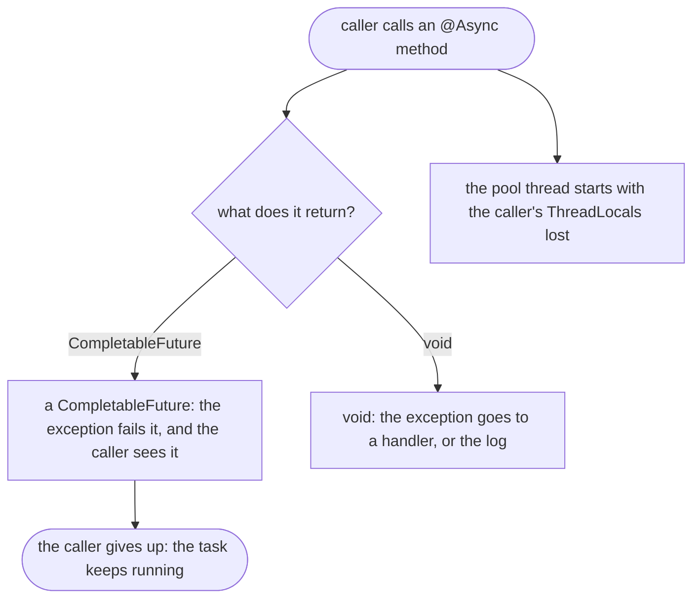

# Future/Promise with Spring Pattern — Data Flow Diagram

What happens to the exception, the context and a cancel when a method goes async.

Mermaid source

```mermaid
flowchart TD
    Call(["caller calls an @Async method"])
    Ret{"what does it return?"}
    Fut["a CompletableFuture: the exception fails it, and the caller sees it"]
    Void["void: the exception goes to a handler, or the log"]
    Ctx["the pool thread starts with the caller's ThreadLocals lost"]
    Give(["the caller gives up: the task keeps running"])
    Call --> Ret
    Ret -- CompletableFuture --> Fut
    Ret -- void --> Void
    Call --> Ctx
    Fut --> Give
```

