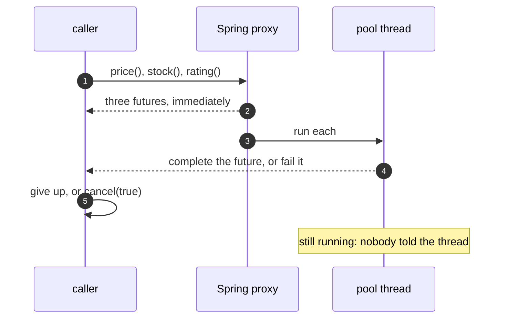

# Future/Promise with Spring Pattern — Sequence Diagram

Written for a listener with the screen off.

Say it in words. The caller asks for a page. It calls three async methods, and gets three futures back at once, before any work has happened. Spring's pool runs each one and completes its future. If a lookup throws, its future fails, and the caller sees the exception when it asks for the result. If the caller gives up waiting, the lookups carry on regardless. If the caller calls cancel, a flag is set, and no thread is interrupted.

Mermaid source

The load-bearing sentence: **the future is the caller's handle, and the thread is not.**
