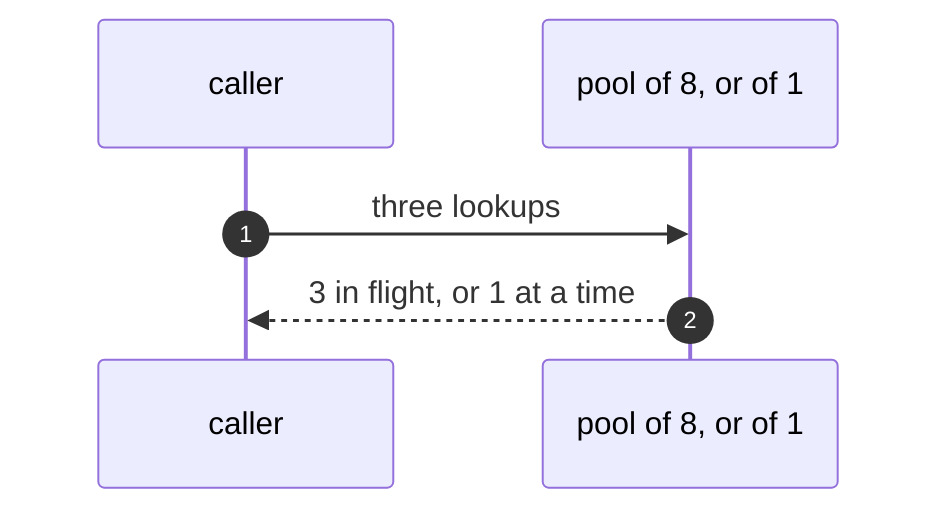
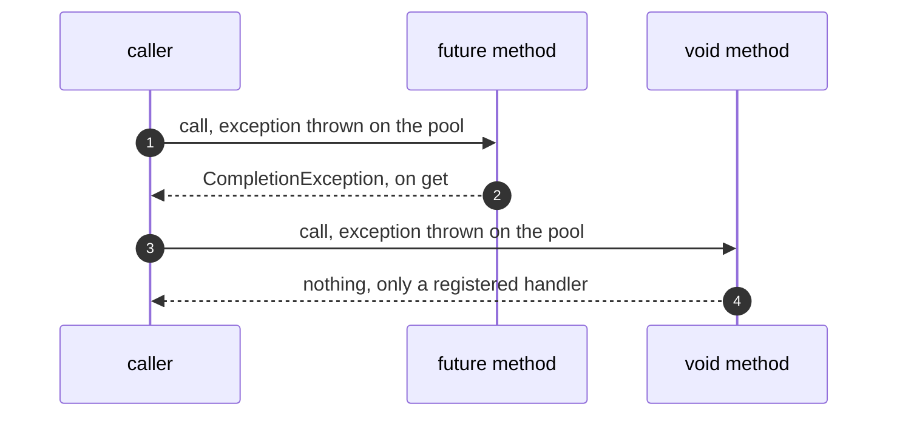
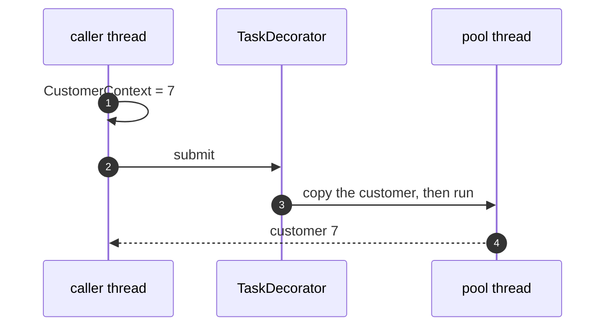
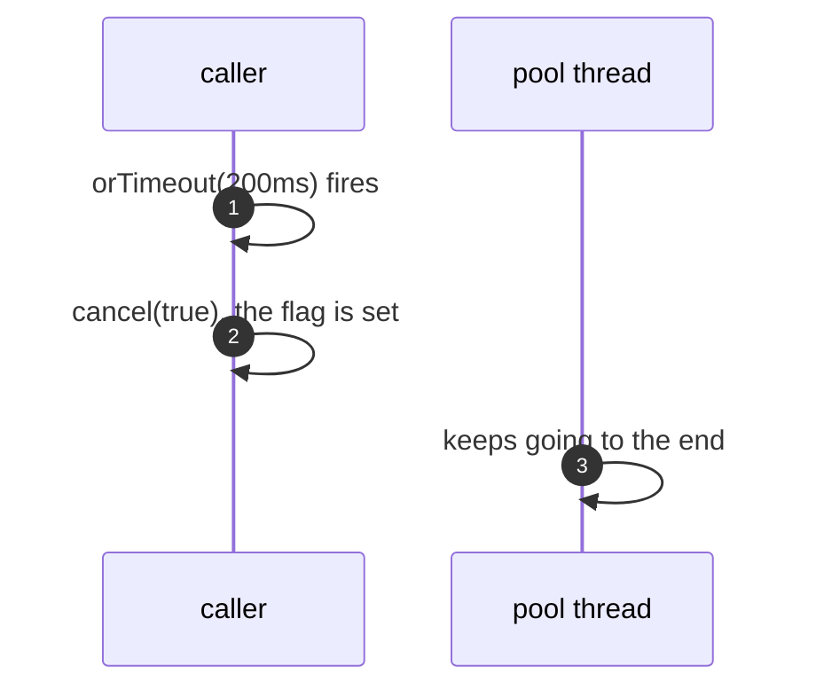

# Future/Promise with Spring Pattern — UML Sequence Diagrams

Four sequences.

## 1. Concurrency Is The Pool's

Mermaid source

## 2. An Exception, Two Ways

Mermaid source

## 3. A Lost Thread-Local

Mermaid source

## 4. Give Up And Cancel

Mermaid source

