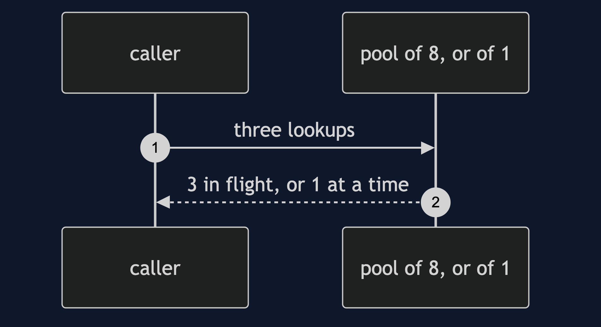
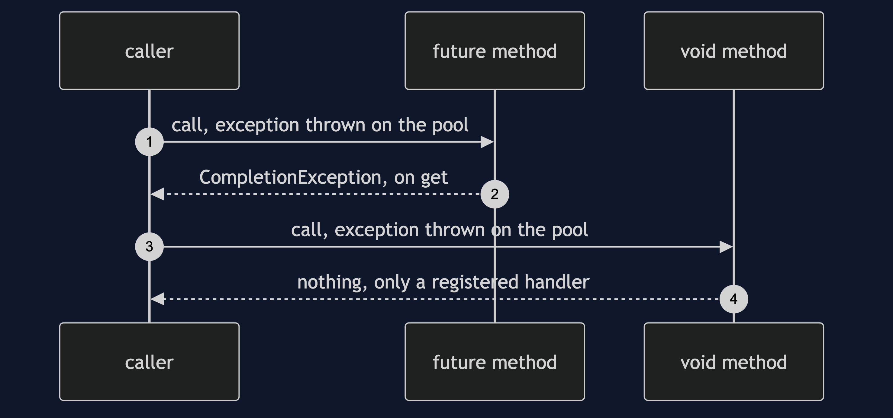
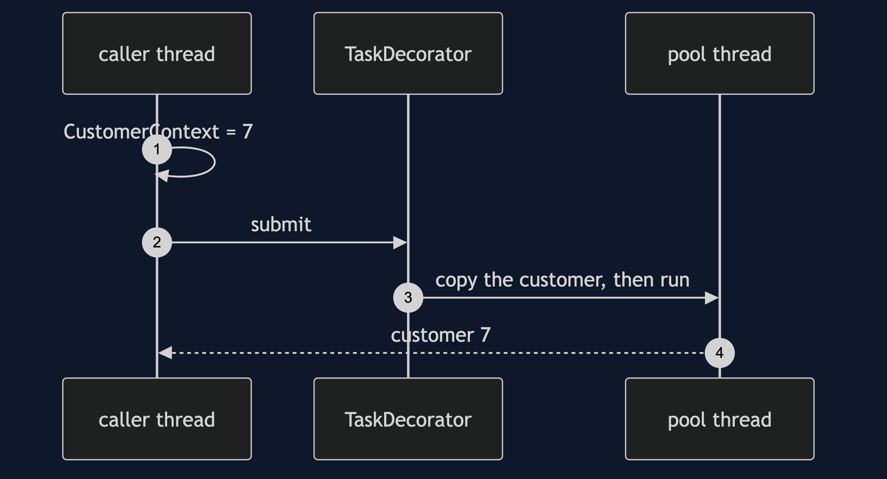
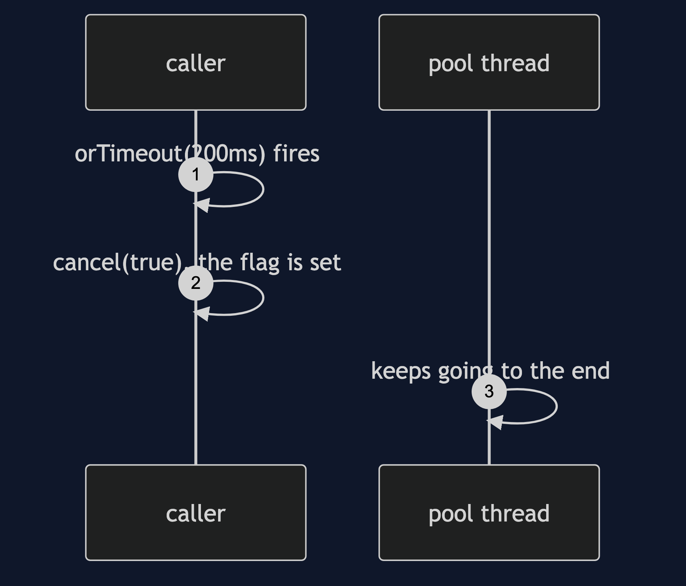

# Future/Promise with Spring Pattern — UML Sequence Diagrams

Four sequences.

## 1. Concurrency Is The Pool's

## 2. An Exception, Two Ways

## 3. A Lost Thread-Local

## 4. Give Up And Cancel

