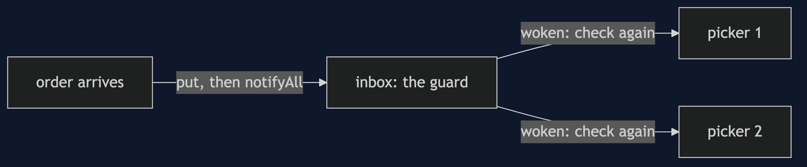

# Guarded Suspension Pattern

```
src/main/java/com/jk/explore/guardedsuspension/
├── GuardedSuspensionDemo.java       the six acts
├── Inbox.java                       put an order, take an order, count the wake-ups
├── WaitingInbox.java                the guard in a while loop; also a limited wait
├── SpinningInbox.java               asks again and again
├── IfGuardInbox.java                the guard checked with if: the bug
└── NoCheckInbox.java                waits without looking first
```

**Guarded suspension: wait until the condition holds, sleeping, and check it again on waking.**

This project is in [concurrency-design-patterns](..). It is the patient partner of [Balking](../balking-pattern), which walks away instead, and the mechanism inside [Producer-Consumer](../producer-consumer-pattern)'s blocking queue.

## Run

```bash
./gradlew run
```

Six acts. Every number quoted below comes from this program's own output.

```
ONE. Waiting by asking.
  the picker asks whether an order has come, over and over. no order has come, and it has already asked more than a million times: true.
  it took [ORD-1] when it arrived. the whole time it kept a processor busy doing nothing.
TWO. Waiting by sleeping.
  the picker's thread is: WAITING. it is using no processor, and has asked nothing.
  an order arrives, the picker is woken, and takes [ORD-1].
THREE. Ask again after waking.
  two pickers wait and one order arrives, with the guard checked with if: they took [ORD-1, null].
  two pickers wait and one order arrives, with the guard checked with while: they took [ORD-1].
  the second picker woke, looked, found nothing, and went back to waiting: true.
FOUR. The order came first.
  the order was already there, and its notification has come and gone. a picker that waits without looking first: WAITING, holding nothing.
  a picker that looks at the guard first takes it at once: [ORD-1].
FIVE. Wait, but not for ever.
  no order comes. after 100 milliseconds the picker gives up: null.
  with an order there: ORD-1.
  a limit turns 'wait until it is true' into 'wait a while, and tell me if it was not'.
SIX. The bill.
  20 pickers waiting, 1 order arrives, and notifyAll: 20 threads woke, 1 took it, 19 went back to sleep.
  and a thread waiting for something nobody will ever send waits for ever. every wait needs a plan for how it ends.
```

## Test

```bash
./gradlew test
```

2 test classes, 8 test methods, offline, with nothing installed and no framework.

## Technologies and versions

| What | Version | Why it is here |
| --- | --- | --- |
| Java | 21 | The repository standard, via the Gradle toolchain block |
| Gradle | 9.2.1 | The wrapper in this directory; no separate install needed |
| JUnit 5 | 5.10.2 | Test runner |

No framework. A hand-built project stays plain Java so the mechanism is the whole lesson.

## Learning Material

| Document | What it covers |
| --- | --- |
| [`docs/problem-statement.md`](docs/problem-statement.md) | The scenario, and the problem |
| [`docs/guarded-suspension-pattern-explained.md`](docs/guarded-suspension-pattern-explained.md) | The pattern, and six acts |
| [`docs/class-diagram.md`](docs/class-diagram.md) | The types |
| [`docs/architecture-diagram.md`](docs/architecture-diagram.md) | The parts and how they connect |
| [`docs/data-flow-diagram.md`](docs/data-flow-diagram.md) | What happens to one request |
| [`docs/sequence-diagram.md`](docs/sequence-diagram.md) | Written for a listener with the screen off |
| [`docs/uml-diagram.md`](docs/uml-diagram.md) | Four sequences |
| [`docs/animation.html`](docs/animation.html) | The six acts in a browser |
| [`docs/prerequisites.md`](docs/prerequisites.md) | What you need to know |
| [`docs/session.md`](docs/session.md) | A one-hour taught session |
| [`docs/spec.md`](docs/spec.md) | The generated specification |
| [`docs/youtube.md`](docs/youtube.md) | Title, description and chapters |

### The pattern in one picture


### Where each piece sits



### How one request moves


### Who calls whom, in order


### All four sequences


### Video

Built from [`video/scenes.py`](video/scenes.py) by
[`video/build_video.sh`](video/build_video.sh). The rendered file is not
committed; see the repository README for why.

## Where you have already met this

`BlockingQueue`, `Future.get()`, `CountDownLatch`, and every thread pool waiting for work.

## When this is too much

Writing wait and notify by hand is rarely right when a blocking queue does it. And where the caller can give up, balking is simpler than waiting.

## Where this sits

This project is in [`concurrency-design-patterns`](..), and is meant to be read with its neighbours there.
