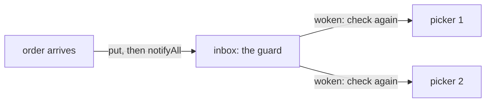

# Guarded Suspension Pattern — Architecture Diagram

Producers put orders in. Pickers wait for them.

Mermaid source

```mermaid
flowchart LR
    P["order arrives"] -->|put, then notifyAll| I["inbox: the guard"]
    I -->|woken: check again| K1["picker 1"]
    I -->|woken: check again| K2["picker 2"]
```

