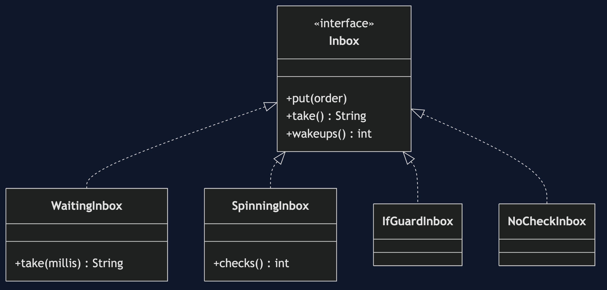
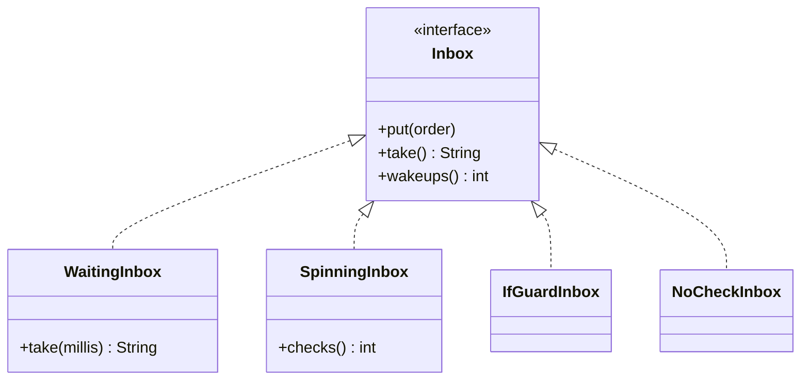

# Guarded Suspension Pattern — Class Diagram

Several inboxes, each waiting a different way.

Mermaid source

```mermaid
classDiagram
    class Inbox {
        <<interface>>
        +put(order)
        +take() String
        +wakeups() int
    }
    class WaitingInbox {
        +take(millis) String
    }
    class SpinningInbox {
        +checks() int
    }
    class IfGuardInbox
    class NoCheckInbox
    Inbox <|.. WaitingInbox
    Inbox <|.. SpinningInbox
    Inbox <|.. IfGuardInbox
    Inbox <|.. NoCheckInbox
```

