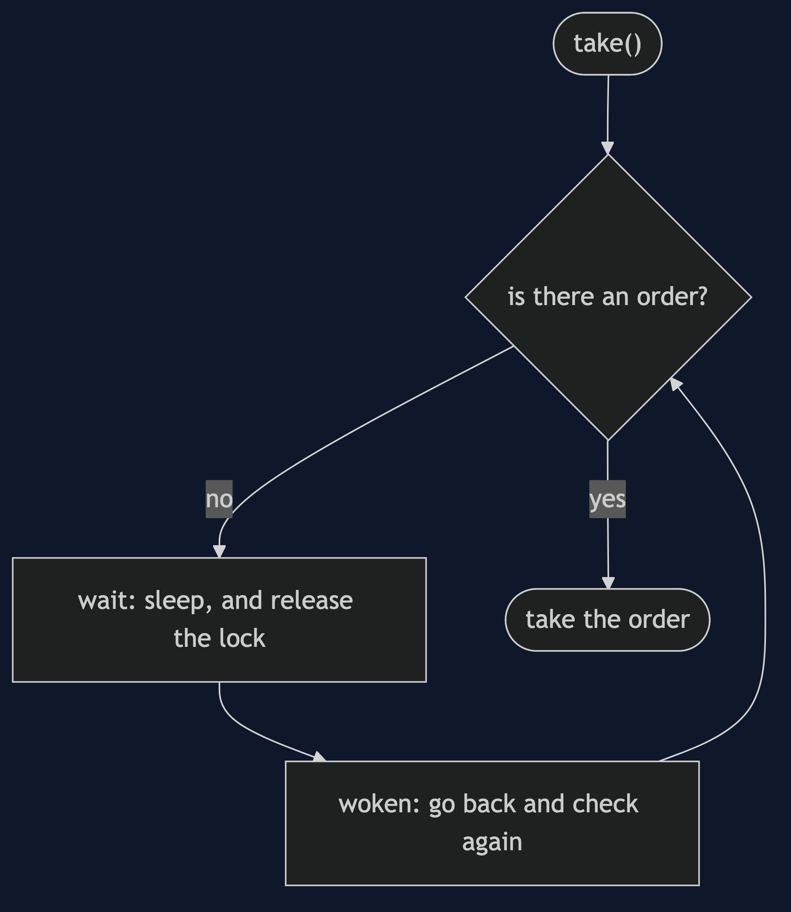
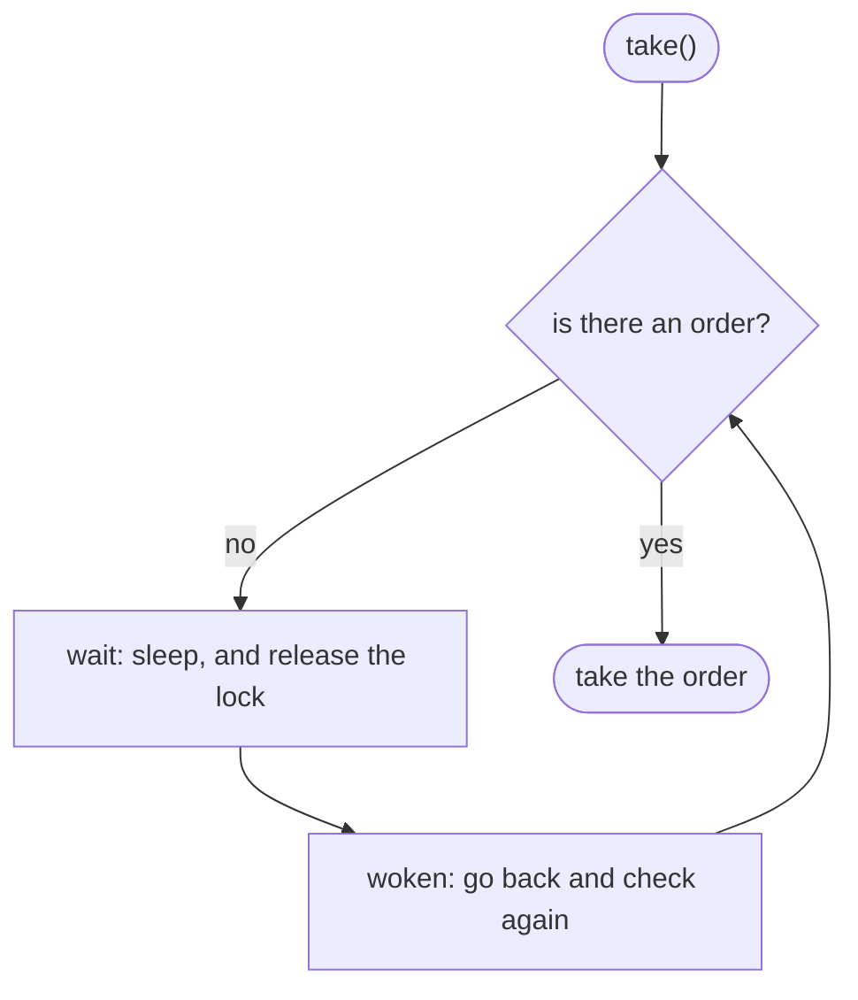

# Guarded Suspension Pattern — Data Flow Diagram

What a picker does in take().

Mermaid source

```mermaid
flowchart TD
    Take(["take()"])
    Guard{"is there an order?"}
    Wait["wait: sleep, and release the lock"]
    Woke["woken: go back and check again"]
    Get(["take the order"])
    Take --> Guard
    Guard -- no --> Wait --> Woke --> Guard
    Guard -- yes --> Get
```

