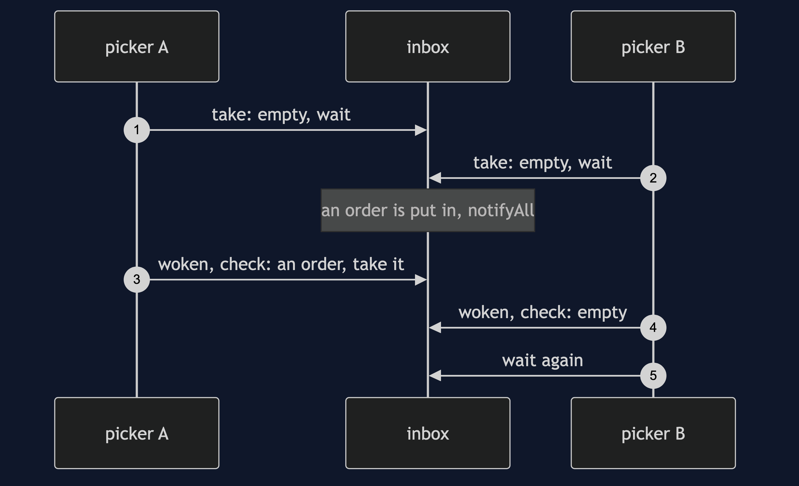
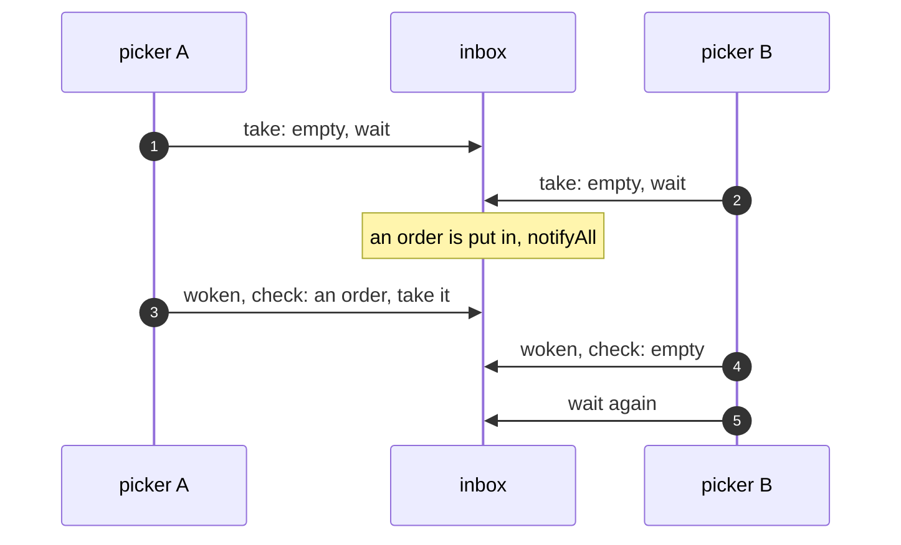

# Guarded Suspension Pattern — Sequence Diagram

Written for a listener with the screen off.

Say it in words. Two pickers each call take, find the inbox empty, and wait. An order is put in the inbox, and everyone waiting is woken. Picker one gets the lock first, checks the guard, finds the order, and takes it. Picker two gets the lock next, checks the guard again, finds it empty, and goes back to waiting. Because the guard was a while and not an if, picker two took nothing by mistake.

Mermaid source

The load-bearing sentence: **the guard is checked again after every wake.**
