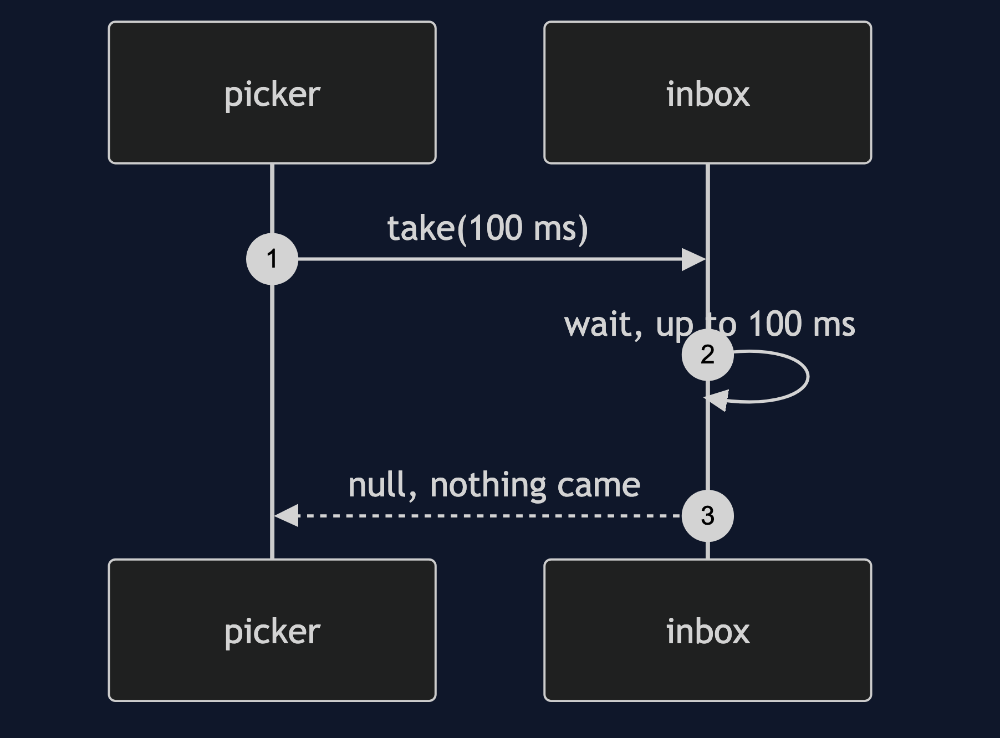
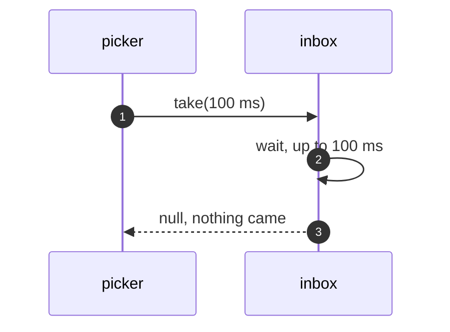

# Guarded Suspension Pattern — UML Sequence Diagrams

Four sequences.

## 1. A Limited Wait

Mermaid source

```mermaid
sequenceDiagram
    autonumber
    participant P as picker
    participant I as inbox
    P->>I: take(100 ms)
    I->>I: wait, up to 100 ms
    I-->>P: null, nothing came
```

