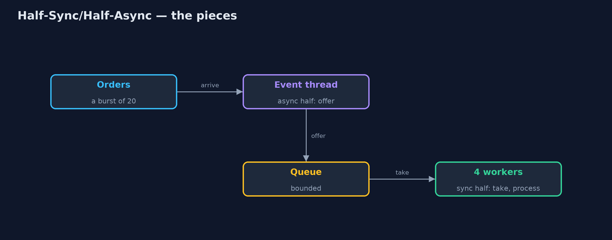
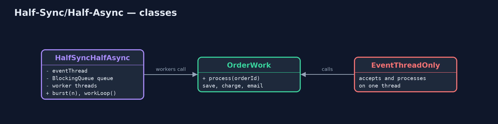

# Half-Sync/Half-Async Pattern

```
src/main/java/com/jk/explore/halfsync/
├── EventThreadOnly.java        Without the pattern: the event thread that receives orders also does each order's blocking work
├── HalfSyncHalfAsync.java      The pattern: a fast asynchronous half that only accepts, a queue in the middle, and a synchronous half of plain worker threads
├── HalfSyncHalfAsyncDemo.java  The five acts: blocking work on the event thread, an async half that only queues, a sync half of plain workers, a queue that absorbs a burst, and the bill
└── OrderWork.java              The slow, blocking work each order needs: save it, charge the card, send the email
```

**Split the work in two: a fast asynchronous half that only accepts events and queues them, and a synchronous half of plain threads that take from the queue and do the slow, blocking work.**

Half-Sync/Half-Async is a concurrency pattern that splits a system into two
layers joined by a queue. The asynchronous half receives events (new orders,
network messages) on a thread that must never block; all it does is put each
event in the queue. The synchronous half is a small group of ordinary worker
threads that take events from the queue and run plain, step-by-step, blocking
code.

The event thread stays responsive under any load, the business code stays
simple to read, and the queue in the middle absorbs bursts.

## The idea in everyday terms

Think of a busy restaurant. The host at the door does one quick job: greet,
write the order on a ticket, and pin it to the rail. The cooks in the kitchen
take tickets from the rail one at a time and cook each dish step by step. If
the host tried to cook as well, the queue at the door would stretch down the
street. And when the rail is full, the host has to say: sorry, we are full.

## The scenario

The online store receives order notifications on an event thread. Each order
then needs 100 milliseconds of blocking work: save it, charge the card, send
the email. The event thread did that work itself, so during a burst of twenty
orders it could not even accept the next one, and the last order waited over
a second and a half just to be acknowledged.

## Run

```bash
./gradlew run
```

The demo tells the story in 5 acts, each printing exact numbers that the tests check:

| Act | What it shows |
| --- | --- |
| 1. Blocking work on the event thread | 20 orders arrive at once; the event thread does each 100 ms job itself; the last order waits over 1.5 s to be accepted. |
| 2. The async half | The event thread only queues: every order is accepted within 0.1 s. |
| 3. The sync half | 4 worker threads take orders and run save, charge, email in order: all 20 done in under 1 s. |
| 4. The queue absorbs the burst | At the busiest moment the queue held 10 or more orders; the event thread never waited for a card payment. |
| 5. The bill | With the workers stalled and a queue of 10, 10 of 20 orders are turned away. |

## Test

```bash
./gradlew test
```

7 tests in `DemoRunsTest`, `HalfSyncHalfAsyncTest`. Every number the demo prints is asserted, and nothing depends on the clock, so every run gives the same result.

## Technologies and versions

| Technology | Version | Used for |
| --- | --- | --- |
| Java | 21 | the code (toolchain set in `build.gradle`) |
| Gradle | 9.2.1 (wrapper) | build and run, nothing to install |
| JUnit | 5.10.2 | the tests |
| videokit | repository tool | the narrated video and animation: Piper `en_US-amy-medium`, speed 0.8, longer pauses (the approved `amy-slow` voice) |

## Learning Material

| Document | What it is for |
| --- | --- |
| [Problem statement](docs/problem-statement.md) | the situation and what the project must show |
| [Prerequisites](docs/prerequisites.md) | what you need to know first |
| [Half-Sync/Half-Async, explained](docs/half-sync-half-async-pattern-explained.md) | the acts in prose |
| [Session guide](docs/session.md) | a one-hour lesson with exercises |
| [Animated walkthrough](docs/animation.html) | the acts step by step, narrated |
| [Spec](docs/spec.md) | what this project must be true of |

### The pattern in one picture

Two halves, one queue.



### Where each piece sits

The pattern class holds both halves and the queue between them.



### How the data moves

Accepted in microseconds, processed when a worker is free.


### Who calls whom, in order

The event thread returns at once; the workers catch up.


### Video

`video/half-sync-half-async-pattern-explained.mp4` (with `.m4a` audio and `.srt` subtitles) is built by `video/build_video.sh`. Rendered media is not committed.

## What it costs

- **A full queue must say no.** With stalled workers and a queue of 10, 10 of 20 orders were turned away; every queue needs a limit and a plan.
- **Two kinds of code.** The async half and the sync half follow different rules, and developers must know which side they are on.
- **Queued work can be lost.** Orders in an in-memory queue vanish if the process stops; real systems persist them.

## When this is too much

When events are few, or the work is already quick and non-blocking, one layer
is simpler. And with Java 21's virtual threads, giving each event its own
virtual thread achieves much of the same with plain code, though a bounded
queue is still the simplest way to limit load.

## Where you have already met this

- Web servers whose event loop hands requests to a worker thread pool.
- `ExecutorService` with a `BlockingQueue`: a direct implementation.
- Message queues between a front-end API and background workers.
- Operating systems: interrupt handlers (async) queue work for kernel threads (sync).

## Where this sits

This project is in [concurrency-design-patterns](..), next to
[Producer-Consumer](../producer-consumer-pattern), the queue at its heart, and
[Reactor](../reactor-pattern), a common asynchronous half.
