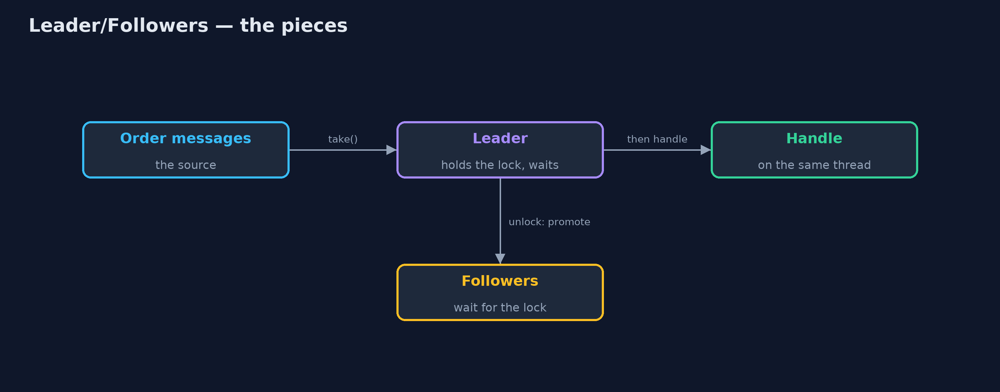
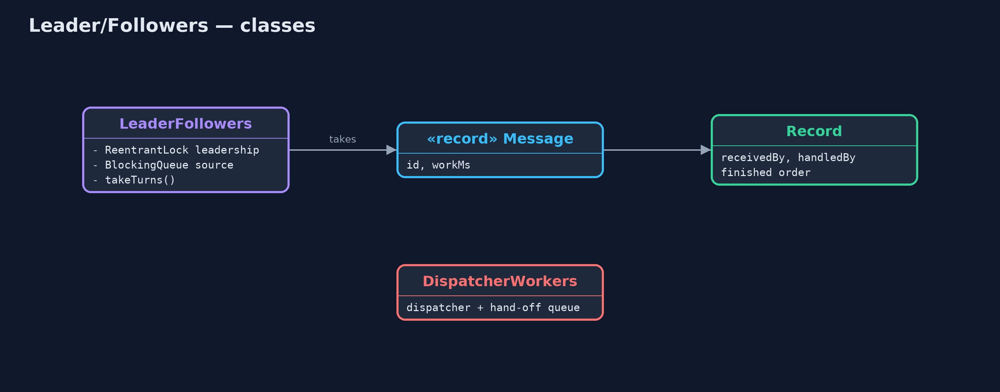
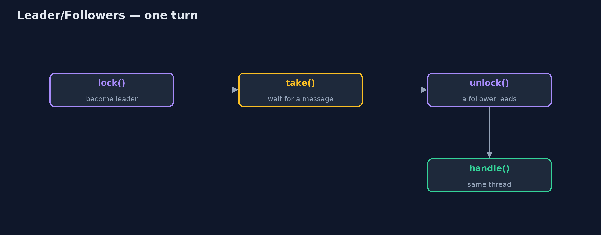
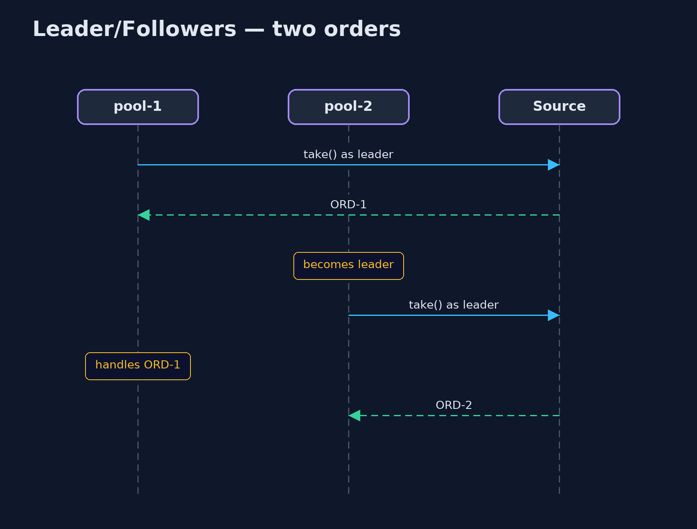

# Leader/Followers Pattern

```
src/main/java/com/jk/explore/leaderfollowers/
├── DispatcherWorkers.java    Without the pattern: one dispatcher thread receives every message and hands it to a worker through a second queue
├── LeaderFollowers.java      The pattern: a pool of threads takes turns
├── LeaderFollowersDemo.java  The five acts: a dispatcher that hands off, leader and followers, leadership passed on, every thread working, and the bill
├── Message.java              An incoming order message, and how long its handling takes
└── Record.java               What happened to each message: which thread received it, which handled it, and in what order they finished
```

**Let a pool of threads take turns: one leader waits for the next message, hands leadership to a follower as soon as it gets one, and then handles that message itself.**

Leader/Followers is a concurrency pattern for a pool of threads that handles
incoming messages. At any moment one thread is the leader and waits for the
next message; the others are followers, waiting to become leader. When the
leader receives a message, it passes leadership to a follower straight away,
and then handles the message itself.

There is no separate dispatcher thread and no second queue: the thread that
received a message is the thread that handles it. That saves a hand-off
between threads for every message, which matters in very high-throughput
servers.

## The idea in everyday terms

Think of a taxi rank. The taxi at the front waits for the next passenger.
When someone gets in, that taxi drives off with them, and the next taxi moves
up to the front to wait. Nobody stands at the rank handing passengers from one
car to another; the car that picks you up is the car that takes you home.

## The scenario

The online store's order service receives a stream of order messages. A
dispatcher thread received each message and passed it through a second queue
to one of four workers. Every message changed threads once, and the dispatcher
itself handled no orders at all.

## Run

```bash
./gradlew run
```

The demo tells the story in 5 acts, each printing exact numbers that the tests check:

| Act | What it shows |
| --- | --- |
| 1. A dispatcher that hands off | 1 dispatcher + 4 workers: 20 hand-offs between threads, 0 orders handled by the thread that received them. |
| 2. Leader and followers | 4 threads and no dispatcher handle 20 orders; only 1 thread ever waits for a message at a time. |
| 3. Receive, promote, handle | Leadership passes 20 times, once per order; 20 of 20 orders are handled by the thread that received them. |
| 4. Every thread works | All 20 orders are handled by several pool threads; none sits as a pure dispatcher. |
| 5. The bill | "Place" then "cancel" for ORD-1 finish as cancel first, place second. |

## Test

```bash
./gradlew test
```

6 tests in `DemoRunsTest`, `LeaderFollowersTest`. Every number the demo prints is asserted, and nothing depends on the clock, so every run gives the same result.

## Technologies and versions

| Technology | Version | Used for |
| --- | --- | --- |
| Java | 21 | the code (toolchain set in `build.gradle`) |
| Gradle | 9.2.1 (wrapper) | build and run, nothing to install |
| JUnit | 5.10.2 | the tests |
| videokit | repository tool | the narrated video and animation: Piper `en_US-amy-medium`, speed 0.8, longer pauses (the approved `amy-slow` voice) |

## Learning Material

| Document | What it is for |
| --- | --- |
| [Problem statement](docs/problem-statement.md) | the situation and what the project must show |
| [Prerequisites](docs/prerequisites.md) | what you need to know first |
| [Leader/Followers, explained](docs/leader-followers-pattern-explained.md) | the acts in prose |
| [Session guide](docs/session.md) | a one-hour lesson with exercises |
| [Animated walkthrough](docs/animation.html) | the acts step by step, narrated |
| [Spec](docs/spec.md) | what this project must be true of |

### The pattern in one picture

One leader waits on the source; followers wait to lead.



### Where each piece sits

Leadership is a lock; the source is a queue.



### How the data moves

Lock, take, unlock, handle.



### Who calls whom, in order

Each thread handles what it received.



### Video

`video/leader-followers-pattern-explained.mp4` (with `.m4a` audio and `.srt` subtitles) is built by `video/build_video.sh`. Rendered media is not committed.

## What it costs

- **Order is not kept.** A "place order" received first finished after a "cancel" received second, because they ran on two threads.
- **Subtle to write.** Getting the hand-over of leadership right needs careful locking.
- **Small gains in Java.** A hand-off between threads is cheap in modern JVMs; the pattern mainly pays off in very high-throughput servers.

## When this is too much

For most Java applications, an `ExecutorService` (a dispatcher with a queue)
is simpler and fast enough. And when messages for the same order must be
handled in order, route them to the same thread instead.

## Where you have already met this

- High-performance C++ servers built with ACE and TAO, where the pattern was described.
- Netty's and other event loops where several threads take turns on a shared selector.
- Several threads calling `accept()` on the same server socket.

## Where this sits

This project is in [concurrency-design-patterns](..), next to
[Half-Sync/Half-Async](../half-sync-half-async-pattern), which does the
opposite, handing every message across a queue, and
[Thread Pool](../thread-pool-pattern).
