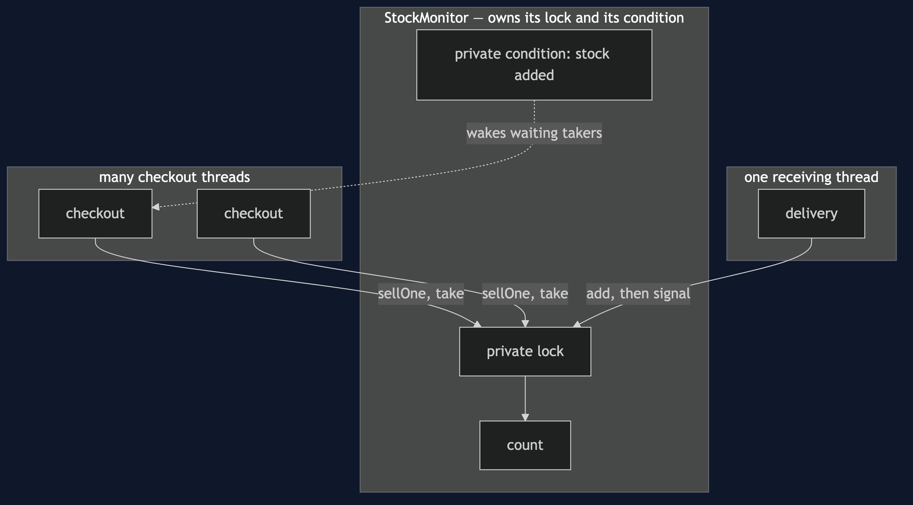
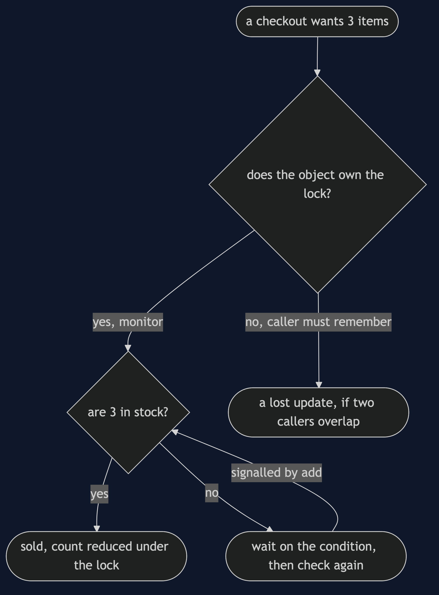
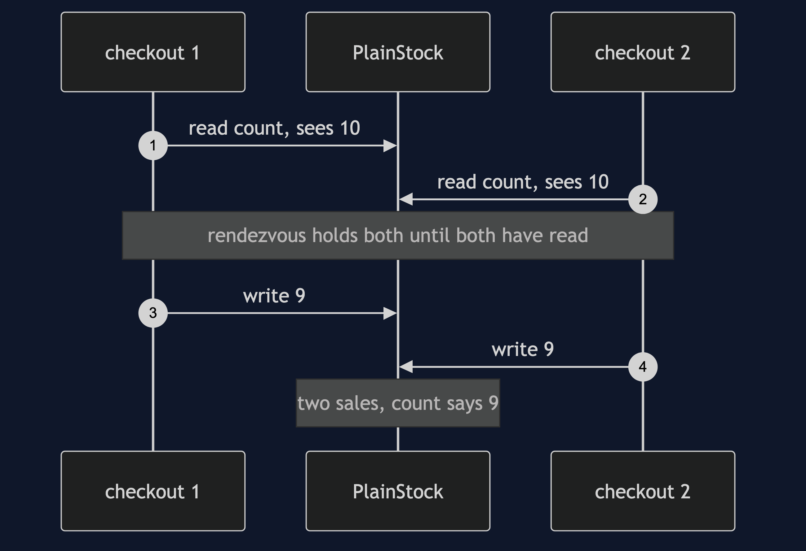
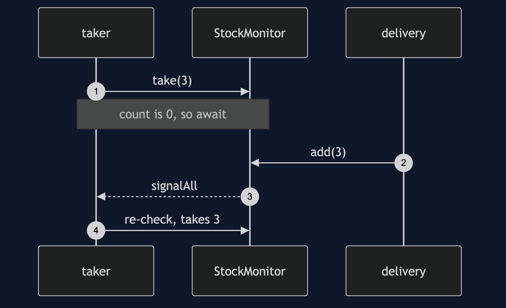
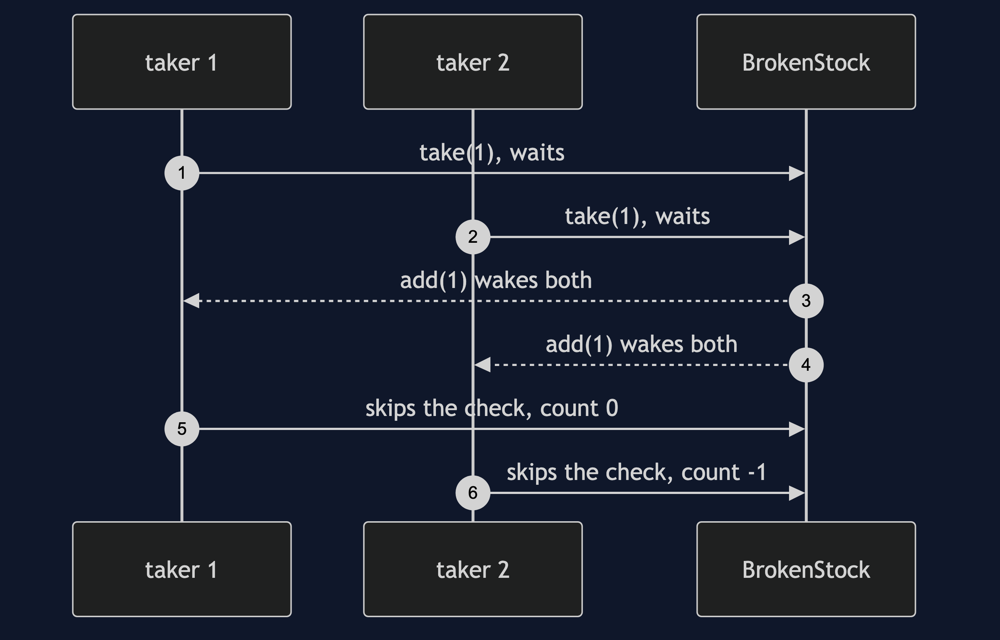
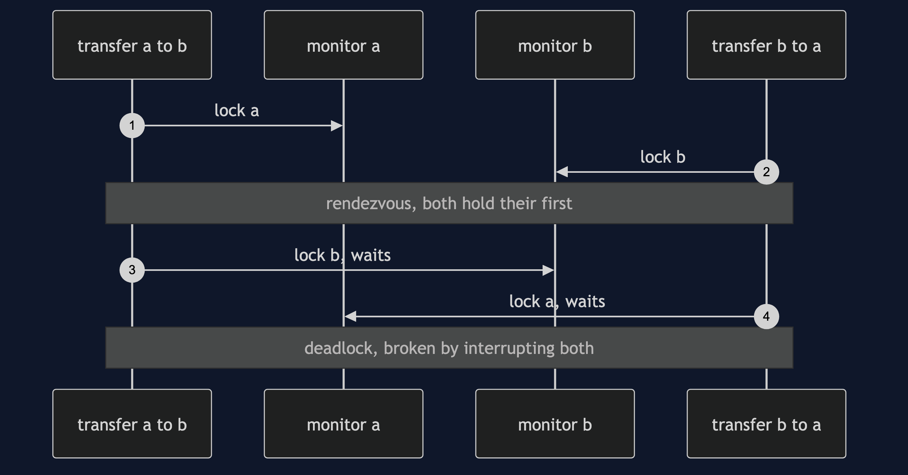

# Monitor Object Pattern

```
src/main/java/com/jk/explore/monitorobject/
├── StockDemo.java                    composition root — the six acts
│
├── harness/                          ← reused unchanged from §46
│   ├── Gate.java
│   ├── Rendezvous.java
│   └── StepExecutor.java
├── naive/
│   ├── PlainStock.java                a bare count — the lost update
│   ├── VolatileStock.java             volatile — visible, not atomic
│   └── CallerLockedStock.java         the lock is the caller's job
│
└── pattern/                          ← the real thing
    ├── StockMonitor.java              private lock, private condition
    ├── IfInsteadOfWhile.java          the wait mistake
    └── MonitorHazards.java            nested monitors, and a callout under the lock
```

**An object owns its own lock and its own waiting, so every method runs
safely and a caller cannot forget to be careful.**

This is the fifth project in
[concurrency-design-patterns](..), reusing
[Producer–Consumer](../producer-consumer-pattern)'s harness directly. The
scenario is one product's stock count: many checkout threads reduce it, and
a delivery thread adds to it.

## Run

```bash
./gradlew run
```

Six acts. The timing in act four is a real measurement and varies; every
other line is what the tests pin.

```
ONE. A plain count — the lost update.
  stock started at 10; two checkout threads each sold one
  stock now: 9 — two items sold, one gone from the count.

TWO. volatile — visible, but still not atomic.
  stock now: 9 — the same lost update, with volatile.

THREE. The caller holds the lock — until one forgets.
  one caller took the lock; one forgot.
  stock now: 9 — the careful caller's lock protected nothing.

FOUR. The pattern — the object owns its lock.
  8 threads x 25000 sales from 200000: 0 left, in 9ms
  a thread waited for 3 items, was signalled by the thread that added them,
  and took them: 0 left.

FIVE. wait() in an if, not a while.
  with if:    stock ends at -1 — a sale of an item that was never there.
  with while: stock ends at 0, and 1 taker is still waiting, correctly.

SIX. When a correct monitor still deadlocks.
  deadlock detected by the JVM: true, broken by interrupting both: true
  timed out: true, after 206ms
```

## Test

```bash
./gradlew test
```

Seven test classes, 13 test methods, most run twenty times via
`@RepeatedTest` — 184 executions, none using `Thread.sleep` to wait for
another thread.

## Technologies and versions

| What | Version | Why it is here |
| --- | --- | --- |
| Java | 21 | The repository standard, via the Gradle toolchain block |
| Gradle | 9.2.1 | The wrapper in this directory; no separate install needed |
| JUnit 5 | 5.10.2 | Test runner; `@RepeatedTest` proves a race rather than merely exercising it |

No frameworks beyond JUnit.

## Learning Material

| Document | What it covers |
| --- | --- |
| [`docs/problem-statement.md`](docs/problem-statement.md) | The stock count, and three naive versions |
| [`docs/monitor-object-pattern-explained.md`](docs/monitor-object-pattern-explained.md) | The pattern and its costs |
| [`docs/determinism.md`](docs/determinism.md) | How each failure is forced |
| [`docs/class-diagram.md`](docs/class-diagram.md) | The types |
| [`docs/architecture-diagram.md`](docs/architecture-diagram.md) | Where each piece runs |
| [`docs/data-flow-diagram.md`](docs/data-flow-diagram.md) | One request to take stock |
| [`docs/sequence-diagram.md`](docs/sequence-diagram.md) | Written for a listener with the screen off |
| [`docs/uml-diagram.md`](docs/uml-diagram.md) | Four sequences |
| [`docs/animation.html`](docs/animation.html) | The six acts in a browser |
| [`docs/prerequisites.md`](docs/prerequisites.md) | What you need to know |
| [`docs/session.md`](docs/session.md) | A one-hour taught session |
| [`docs/spec.md`](docs/spec.md) | The generated specification |
| [`docs/youtube.md`](docs/youtube.md) | Title, description and chapters |

### The pattern in one picture


### Where each piece runs



### How one request moves



### Who calls whom, in order


### All four sequences









### Video

Built from [`video/scenes.py`](video/scenes.py) by
[`video/build_video.sh`](video/build_video.sh). The rendered file is not
committed; see the repository README for why.

## When this is too much

For a single counter, `AtomicInteger` is simpler and faster. The monitor
earns its place when several fields must change together, or when threads
must wait for a condition.

## Where this sits

This is the fifth of six projects in [`concurrency-design-patterns`](..).
The last project, **Active Object**, is the capstone: it takes away the lock
altogether by giving the object one thread of its own.
