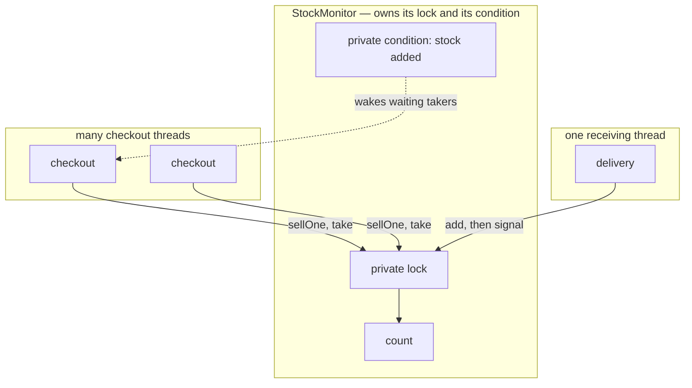

# Monitor Object Pattern — Architecture Diagram

Where each piece runs, and the one shared count each approach protects.

Mermaid source

```mermaid
flowchart TB
    subgraph Checkout["many checkout threads"]
        C1["checkout"]
        C2["checkout"]
    end
    subgraph Receiving["one receiving thread"]
        D["delivery"]
    end
    subgraph Monitor["StockMonitor — owns its lock and its condition"]
        Lock["private lock"]
        Cond["private condition: stock added"]
        Count["count"]
    end
    C1 -->|sellOne, take| Lock
    C2 -->|sellOne, take| Lock
    D -->|add, then signal| Lock
    Lock --> Count
    Cond -.->|wakes waiting takers| C1
```

