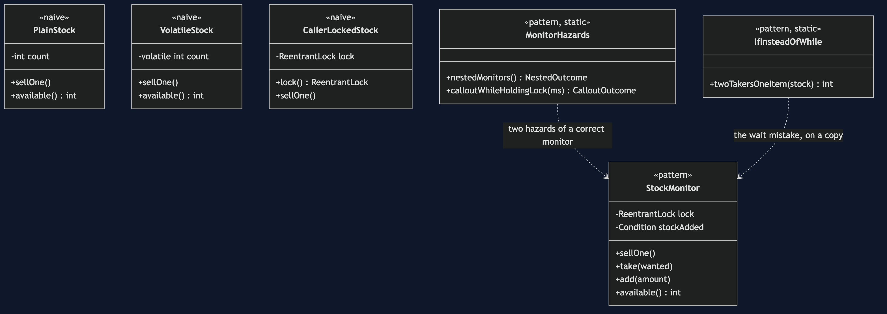
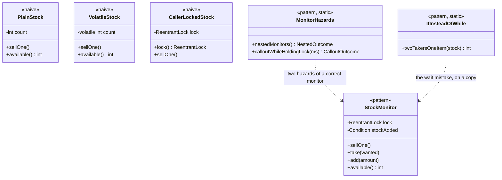

# Monitor Object Pattern — Class Diagram

Three naive classes share one shape, `sellOne()` and `available()`, and
differ only in where the protection lives. `StockMonitor` is the only one
whose lock is private.

Mermaid source

## Reading The Diagram

`CallerLockedStock` exposes its lock through a public method. That one
method is the whole difference from `StockMonitor`, whose lock is private.
