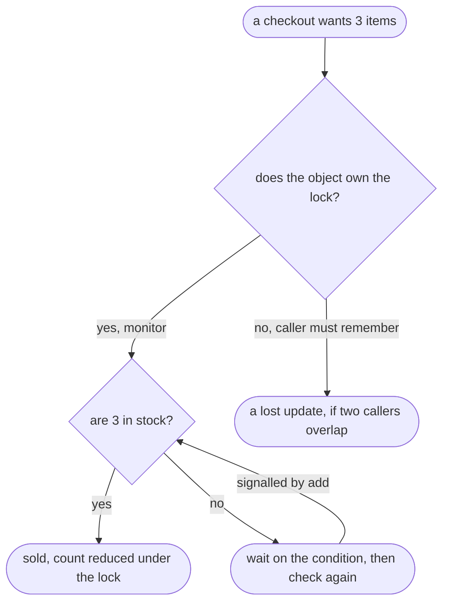

# Monitor Object Pattern — Data Flow Diagram

One request to take stock: to a sale, to a wait, or to a lost update.

Mermaid source

```mermaid
flowchart TD
    Req(["a checkout wants 3 items"])
    Own{"does the object own the lock?"}
    Enough{"are 3 in stock?"}
    Sold(["sold, count reduced under the lock"])
    Wait(["wait on the condition, then check again"])
    Lost(["a lost update, if two callers overlap"])
    Req --> Own
    Own -- yes, monitor --> Enough
    Own -- no, caller must remember --> Lost
    Enough -- yes --> Sold
    Enough -- no --> Wait
    Wait -->|signalled by add| Enough
```

