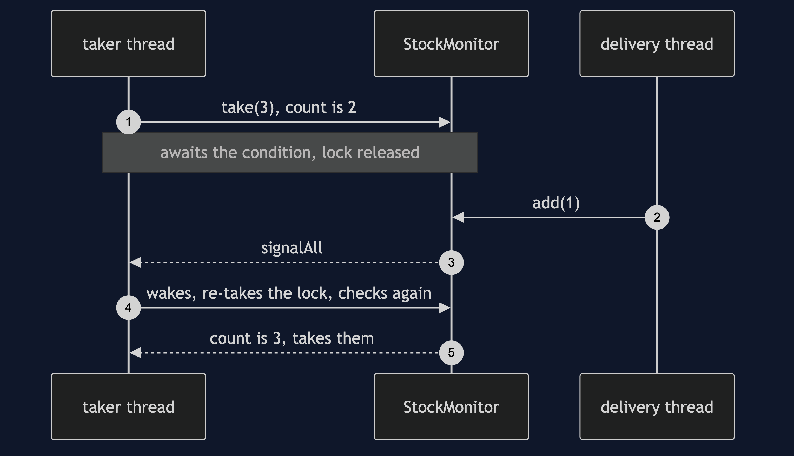
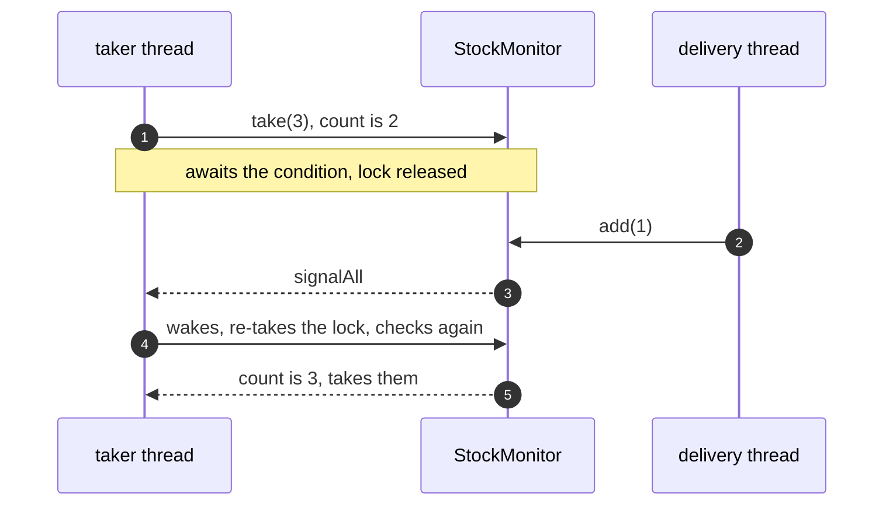

# Monitor Object Pattern — Sequence Diagram

Written for a listener with the screen off.

Say it in words. A taker thread asks the monitor for three items and finds
two. It waits on the monitor's own condition, releasing the lock while it
waits. A delivery thread takes the lock, adds one item, and signals every
waiter. The taker wakes, takes the lock again, and checks again. It now
sees three, takes them, and leaves.

Mermaid source

The load-bearing sentence: **the taker checks again after waking, because
being woken means stock may be there, not that it is.**
