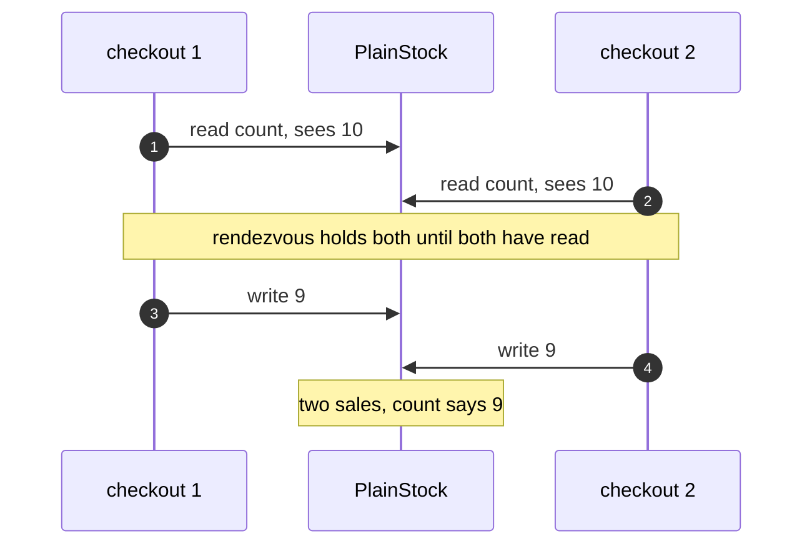
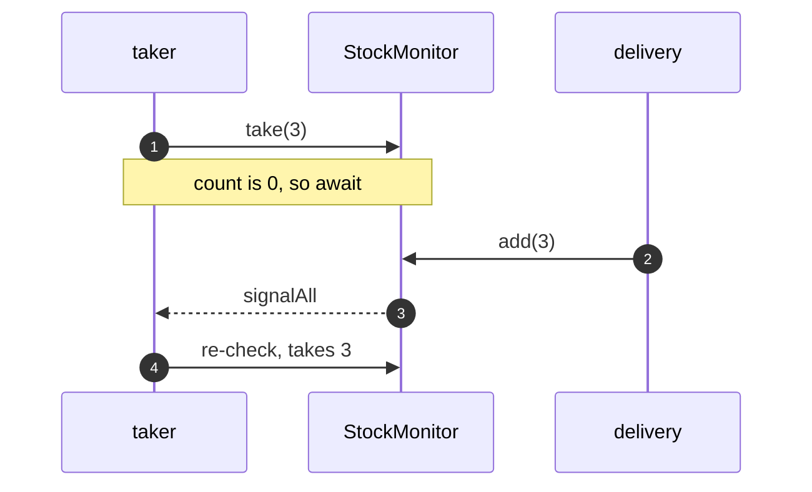
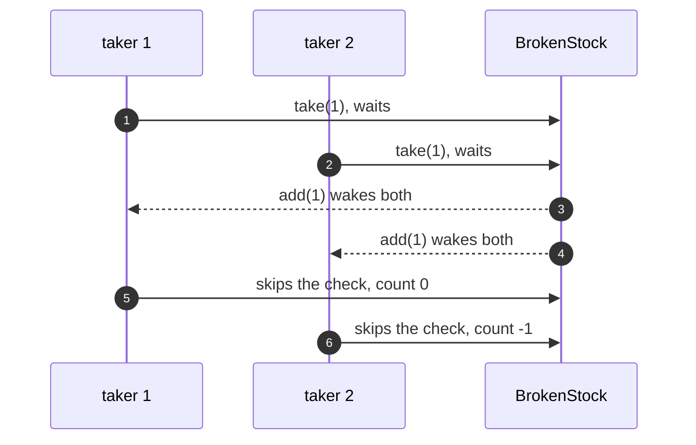
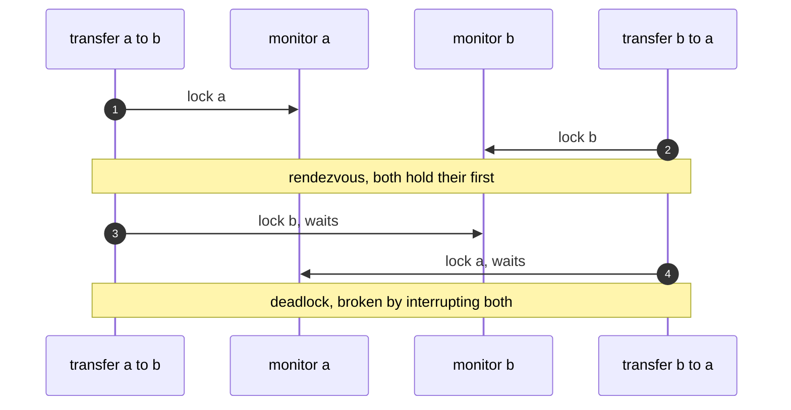

# Monitor Object Pattern — UML Sequence Diagrams

Four sequences: the lost update, waiting and signalling, `if` instead of
`while`, and the nested-monitor deadlock.

## 1. The Lost Update

Mermaid source

## 2. Waiting And Signalling

Mermaid source

## 3. if Instead Of while

Mermaid source

## 4. Nested Monitors

Mermaid source

