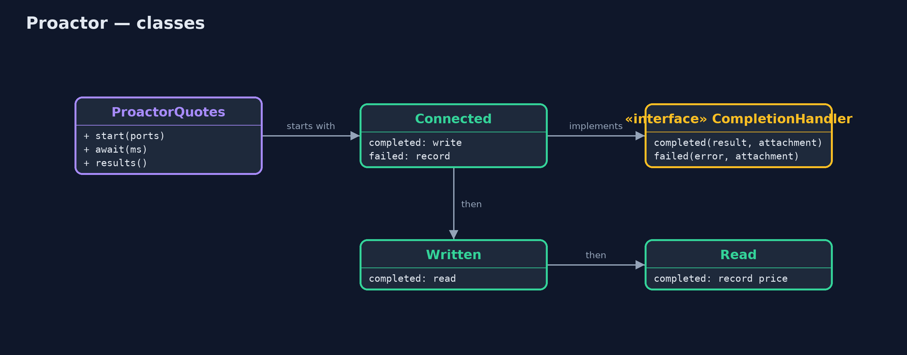

# Proactor Pattern

```
src/main/java/com/jk/explore/proactor/
├── BlockingQuotes.java  Without the pattern: ask each supplier in turn, and wait for each answer before asking the next
├── ProactorDemo.java    The five acts: asking suppliers one by one, starting every request at once, completion handlers, a failure as a completion, and the bill
├── ProactorQuotes.java  The pattern: start every operation at once, and let the system call a completion handler when each one finishes
└── Supplier.java        A supplier's price server on this machine: answers "price KETTLE-1" with its price in pence, after 200 ms
```

**Start slow operations without waiting for them, and give each one a completion handler that the system calls when it finishes, successfully or not.**

Proactor is a concurrency pattern for slow input and output, such as network
calls. Instead of starting an operation and waiting for it, the program starts
it and hands over a completion handler: a small object that says what to do
when the operation finishes, and what to do if it fails. The system does the
waiting and calls the handler when the result is ready.

Many operations can then be in flight at once from a single caller, and their
waiting overlaps. Java's asynchronous channels (`AsynchronousSocketChannel`,
`AsynchronousFileChannel`) and `CompletionHandler` are a direct
implementation.

## The idea in everyday terms

Think of a food court with a buzzer at every stall. You order at five stalls,
one after another, and each hands you a buzzer. You do not queue at a stall
until your dish is cooked. You sit down, and as each buzzer goes off, you go
and collect that dish. If one stall runs out of what you ordered, its buzzer
goes off too, and they tell you.

## The scenario

The online store's warehouse buys kettles from five suppliers. Before each
order it asks all five for today's price and picks the cheapest. Each supplier
takes 0.2 seconds to answer, and the warehouse asked them one after another,
waiting for each answer before asking the next: over a second every time.

## Run

```bash
./gradlew run
```

The demo tells the story in 5 acts, each printing exact numbers that the tests check:

| Act | What it shows |
| --- | --- |
| 1. One after another | Five suppliers at 0.2 s each, asked in turn: 5 prices in over 0.9 s, the asking thread blocked throughout. |
| 2. Start everything at once | All 5 requests start and start() returns in under 0.1 s; all 5 answers arrive in under 0.6 s. |
| 3. Completion handlers | The read handlers record £21.00, £19.50, £22.40, £18.90 and £20.10; the cheapest is £18.90. |
| 4. A failure is a completion | Supplier 6 is down: its failed() handler runs; the other 2 answer as normal. |
| 5. The bill | One request is spread across Connected, Written and Read handlers; the steps no longer read top to bottom. |

## Test

```bash
./gradlew test
```

7 tests in `DemoRunsTest`, `ProactorQuotesTest`. Every number the demo prints is asserted, and nothing depends on the clock, so every run gives the same result.

## Technologies and versions

| Technology | Version | Used for |
| --- | --- | --- |
| Java | 21 | the code (toolchain set in `build.gradle`) |
| Gradle | 9.2.1 (wrapper) | build and run, nothing to install |
| JUnit | 5.10.2 | the tests |
| videokit | repository tool | the narrated video and animation: Piper `en_US-amy-medium`, speed 0.8, longer pauses (the approved `amy-slow` voice) |

## Learning Material

| Document | What it is for |
| --- | --- |
| [Problem statement](docs/problem-statement.md) | the situation and what the project must show |
| [Prerequisites](docs/prerequisites.md) | what you need to know first |
| [Proactor, explained](docs/proactor-pattern-explained.md) | the acts in prose |
| [Session guide](docs/session.md) | a one-hour lesson with exercises |
| [Animated walkthrough](docs/animation.html) | the acts step by step, narrated |
| [Spec](docs/spec.md) | what this project must be true of |

### The pattern in one picture

The caller starts; the system waits; handlers finish the work.


### Where each piece sits

Three small handlers, chained.



### How the data moves

Five 0.2 s waits, side by side instead of end to end.


### Who calls whom, in order

Three completions, three handlers.


### Video

`video/proactor-pattern-explained.mp4` (with `.m4a` audio and `.srt` subtitles) is built by `video/build_video.sh`. Rendered media is not committed.

## What it costs

- **One request, several callbacks.** Connect, write and read each finish in a different handler; the steps no longer read top to bottom.
- **Harder debugging.** Stack traces start in the system's threads, not in the code that started the work.
- **Shared results.** Handlers run on other threads, so results must be collected safely.

## When this is too much

When operations are few, fast or must happen in order, plain blocking calls
are clearer. And in modern Java, virtual threads let you write blocking code
that waits just as cheaply; `CompletableFuture` or a reactive library gives a
friendlier face to the same idea.

## Where you have already met this

- `AsynchronousSocketChannel` and `CompletionHandler` in Java NIO.2.
- `HttpClient.sendAsync` and `CompletableFuture.thenAccept`.
- Windows I/O completion ports and Linux io_uring, which the pattern is named after.
- Callbacks in JavaScript's Node.js file and network APIs.

## Where this sits

This project is in [concurrency-design-patterns](..), next to
[Reactor](../reactor-pattern), which is told when an operation *can* be done;
a proactor is told when it *has been* done.
