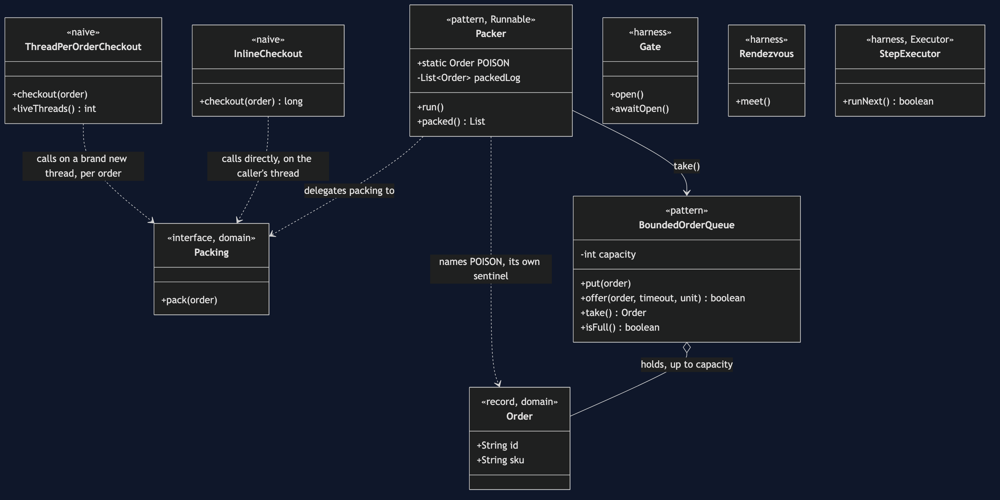
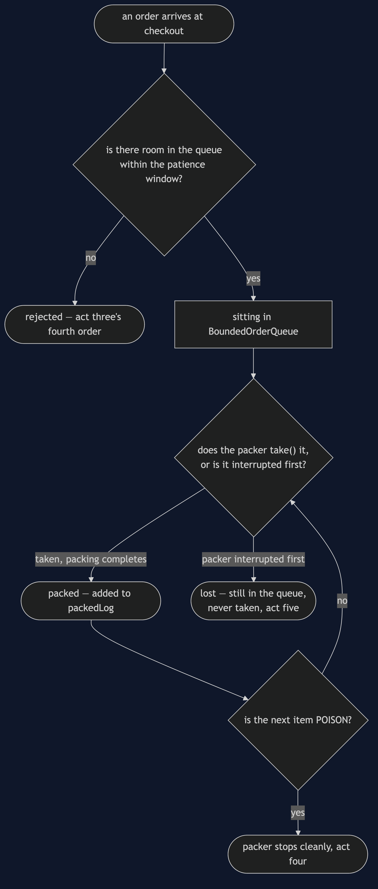
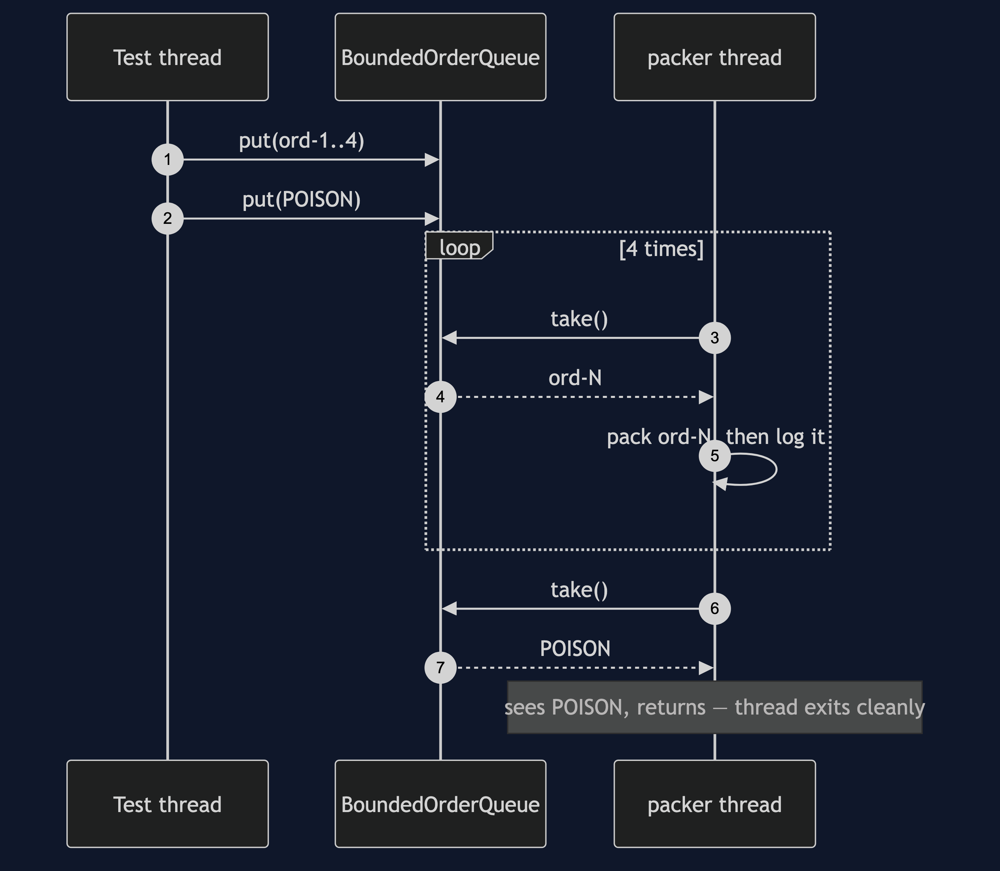
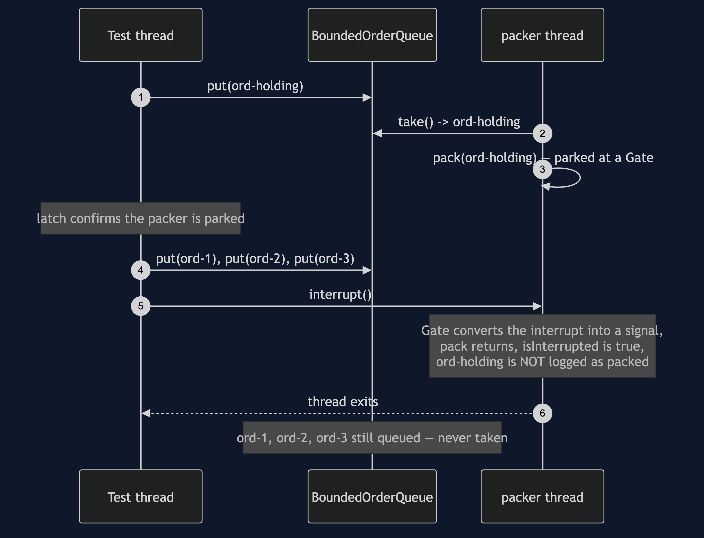
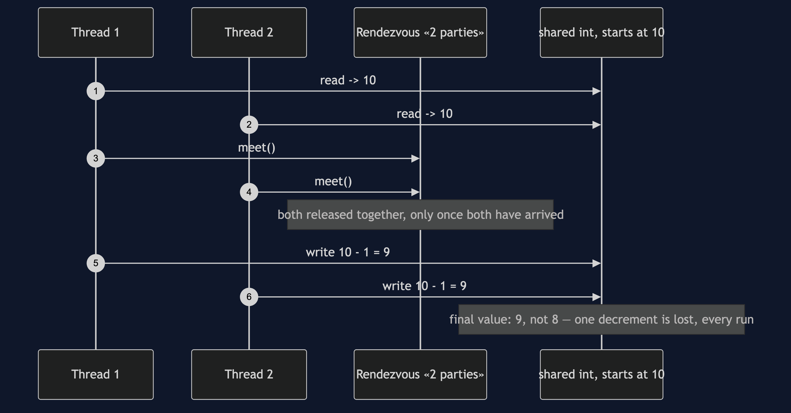

# Producer–Consumer Pattern

```
src/main/java/com/jk/explore/producerconsumer/
├── PackingWarehouseDemo.java       composition root — the five acts
│
├── domain/
│   ├── Order.java                   record(id, sku)
│   └── Packing.java                 «functional interface» pack(order)
├── harness/                         ← reused by every later project in this category
│   ├── Gate.java                     one-shot door — provably closed until opened
│   ├── Rendezvous.java               barrier that forces a specific interleaving
│   └── StepExecutor.java             queues work, runs it only when told to
├── naive/                           ← kept on purpose, both replaced by the pattern
│   ├── InlineCheckout.java           checkout packs the order itself
│   └── ThreadPerOrderCheckout.java   one new thread per order, uncapped
│
└── pattern/                         ← the real thing
    ├── BoundedOrderQueue.java        a fixed-capacity ArrayBlockingQueue<Order>
    └── Packer.java                   the one consumer thread; Packer.POISON is the stop signal
```

**A bounded queue sits between whoever produces work and whoever consumes
it, so each side runs at its own pace up to a limit that is chosen on
purpose, not discovered by accident.**

This is the reference project for the
[concurrency-design-patterns](..) category: the queue every other pattern
in this category eventually sits behind or in front of, and the project
that builds the three determinism-forcing pieces — `Gate`, `Rendezvous`,
`StepExecutor` — that every later project reuses rather than reinvents.

## Run

```bash
./gradlew run
```

Five acts.

Act one is checkout packing every order itself.

```
ONE. No queue at all — checkout packs the order itself.
  checkout(ord-1) returned after 47ms
  checkout(ord-2) returned after 41ms
  checkout(ord-3) returned after 41ms
  three checkouts, 129ms of it spent packing, on the checkout thread
  every customer behind order one waited for order one's pack.
```

Act two is a thread per order — fast to return, uncapped, and measured.

```
TWO. A thread per order — works, until it does not.
  created 2,000 real threads in 94.5ms (47.2 microseconds each)
  at that rate, 100,000 threads costs roughly 4724ms of creation alone —
  before any of them has packed a single order.
  each thread also holds a stack (default ~512KB-1MB);
  that is where OutOfMemoryError: unable to create native
  thread comes from. Not simulated here — a laptop that
  actually hits that limit is not a teaching aid.
```

Act three fills the bounded queue to capacity, deterministically, and shows
a further order rejected.

```
THREE. The bounded queue — and what 'full' costs.
  queue filled to capacity 3: 3
  one more order, offered with a 150ms patience: REJECTED — the queue never had room in time
  released: the packer drains the 3 that were queued
```

Act four is the clean shutdown — a poison pill drains everything ahead of
it first.

```
FOUR. Clean shutdown — the queue drains before the packer stops.
  4 orders queued, then the poison pill.
  packed before stopping: 4 of 4
```

Act five is the abrupt shutdown — an interrupt abandons whatever was still
queued.

```
FIVE. Abrupt shutdown — whatever is still queued is lost.
  1 order was being packed, 4 more were queued behind it.
  the packer thread was interrupted, not signalled to drain.
  orders lost, still in the queue: 4
```

## Test

```bash
./gradlew test
```

Six test classes, twelve test methods between them, several of them run
twenty times each via `@RepeatedTest` because a race that only sometimes
reproduces has not actually been proven — 88 executions total, zero of
them using `Thread.sleep` to wait for another thread. `HarnessSelfTest` proves the
three shared harness pieces against real races before anything else in the
project relies on them; `PackerTest` proves both shutdowns; `BoundedOrderQueueTest`
proves the queue actually reaches capacity and actually rejects.

## Technologies and versions

| What | Version | Why it is here |
| --- | --- | --- |
| Java | 21 | The repository standard, via the Gradle toolchain block |
| Gradle | 9.2.1 | The wrapper in this directory; no separate install needed |
| JUnit 5 | 5.10.2 | Test runner — `@RepeatedTest` is how this project proves a race, not merely exercises it |

No ArchUnit, no Spring, no framework of any kind. `java.util.concurrent`
is this category's entire subject, so every project in it, including this
one, uses nothing beyond the JDK.

## Learning Material

| Document | What it covers |
| --- | --- |
| [`docs/problem-statement.md`](docs/problem-statement.md) | The two naive versions, and what the pattern has to deliver |
| [`docs/producer-consumer-pattern-explained.md`](docs/producer-consumer-pattern-explained.md) | Why "bounded" is the whole pattern, the two ways "no" can be said, and the two shutdowns |
| [`docs/determinism.md`](docs/determinism.md) | The three harness pieces, where each is used, and the honesty rule about what a passing test does and does not prove |
| [`docs/class-diagram.md`](docs/class-diagram.md) | The types, and why nothing can bypass the queue's bound |
| [`docs/architecture-diagram.md`](docs/architecture-diagram.md) | Where each piece runs, producer side and consumer side |
| [`docs/data-flow-diagram.md`](docs/data-flow-diagram.md) | One order, from arrival to packed, rejected, or lost |
| [`docs/sequence-diagram.md`](docs/sequence-diagram.md) | Who calls whom, in order — written for a listener with the screen off |
| [`docs/uml-diagram.md`](docs/uml-diagram.md) | Four sequences: capacity reached, clean shutdown, abrupt shutdown, the harness's own proof |
| [`docs/animation.html`](docs/animation.html) | The five acts in a browser |
| [`docs/prerequisites.md`](docs/prerequisites.md) | What you need to know, and what this project introduces from scratch |
| [`docs/session.md`](docs/session.md) | A one-hour taught session with exercises |
| [`docs/spec.md`](docs/spec.md) | The generated specification, with measured test counts and timings |
| [`docs/youtube.md`](docs/youtube.md) | Title, description and chapters for the video |

### The pattern in one picture

The single most important thing on this diagram: `BoundedOrderQueue` has a
fixed capacity, and nothing in `Checkout` or `Packer` can bypass it — there
is no path onto the queue except through a method that respects the bound.



### Where each piece runs

Producer side and consumer side, and the one bounded buffer that stands
between them.


### How one order moves

From arrival at checkout to being packed — or rejected, or lost at an
abrupt shutdown.



### Who calls whom, in order

The sequence written to work with the screen off: a test thread parks the
packer mid-pack behind a closed gate, confirms with a latch — not a guess —
that it is truly stuck there, then fills the queue to its capacity of
three and watches a fourth order get rejected after its patience runs out.


### All four sequences

The full set from [`docs/uml-diagram.md`](docs/uml-diagram.md).

**One. The queue reaches capacity, and says no.**


**Two. Clean shutdown — the pill travels through the queue.** Everything
queued ahead of `Packer.POISON` is still taken and packed first.



**Three. Abrupt shutdown — whatever is queued is lost.** The interrupt
stops the packer wherever it is; nothing behind it is ever reached.



**Four. The harness's own proof — a lost update, every run.** `Rendezvous`
forcing two threads to both read the same stale value before either writes.



### Video

The narrated walkthrough is built from
[`video/scenes.py`](video/scenes.py) by
[`video/build_video.sh`](video/build_video.sh). The rendered file is not
committed — see the repository README for why.

## When this is too much

Worth it the moment producing and consuming genuinely happen at different,
independent rates — which is most real systems with any I/O in them at
all. Not worth it for two pieces of code that always run in lockstep
anyway; a queue between two things that can never get out of step with
each other is ceremony with no back-pressure decision behind it.

## Where this sits

This is the reference project for
[`concurrency-design-patterns`](..) — first of six, built and published
first because every other project in the category assumes its queue, or
its three harness pieces, or both.

The next project, **Thread Pool**, answers the question this project
leaves open on purpose: what happens when more than one consumer takes
from the same queue.
