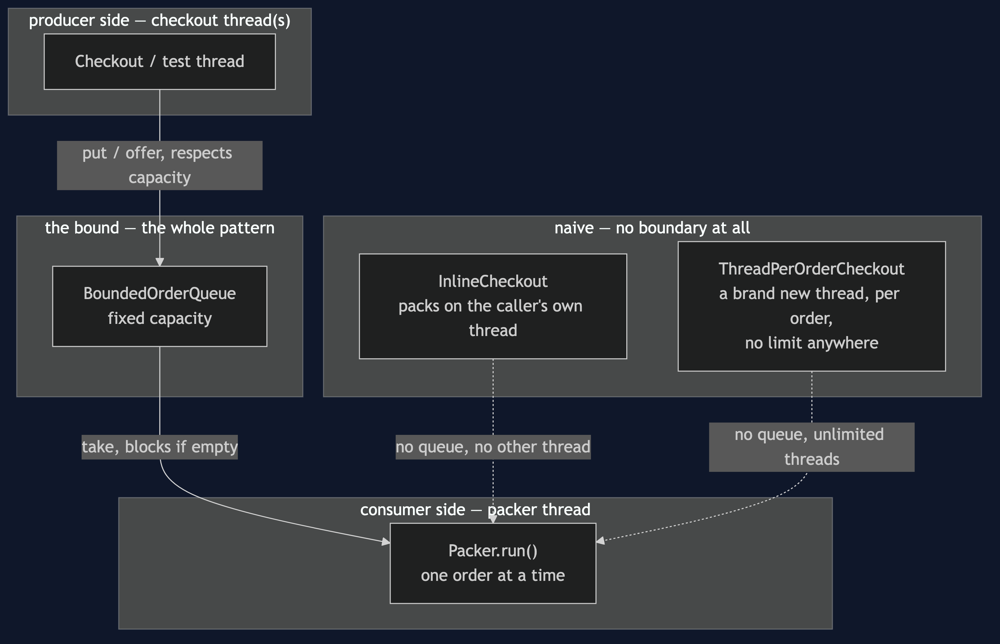
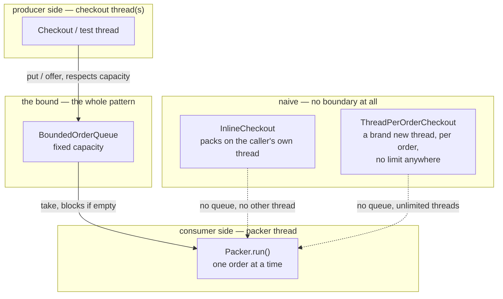

# Producer–Consumer Pattern — Architecture Diagram

Where each piece runs, and what stands between the producer side and the
consumer side.

Mermaid source

## Reading The Diagram

**Exactly one box sits between the producer side and the consumer side,
and it has a capacity.** That is the pattern in its entirety: not a queue,
a *bounded* queue.

**The naive box has no line into the boundary at all.** `InlineCheckout`
runs packing on the same thread as checkout — there is no second side to
have a boundary between. `ThreadPerOrderCheckout` has a second side, but no
boundary — every order gets a thread, with nothing capping how many exist
at once.
