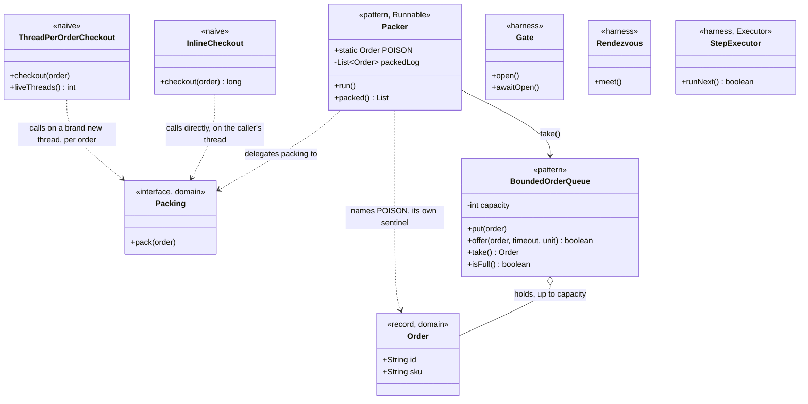

# Producer–Consumer Pattern — Class Diagram

The single most important thing on this diagram: `BoundedOrderQueue` has a
fixed `capacity`, and nothing in `Checkout` or `Packer` can bypass it —
there is no path onto the queue except through a method that respects the
bound.

Mermaid source

## Reading The Diagram

**`Packer` depends on `BoundedOrderQueue` and on `Packing` — nothing else.**
It does not know whether it is being driven by the demo, a test, or five
producers at once; it only ever takes one order at a time and does
whatever `Packing` says.

**Neither naive class has any relationship to `BoundedOrderQueue` at all.**
`InlineCheckout` and `ThreadPerOrderCheckout` both talk to `Packing`
directly — one on the caller's own thread, one on a new thread per order —
because neither of them has a queue standing between arrival and packing.
That absence is the entire diagram's argument.
