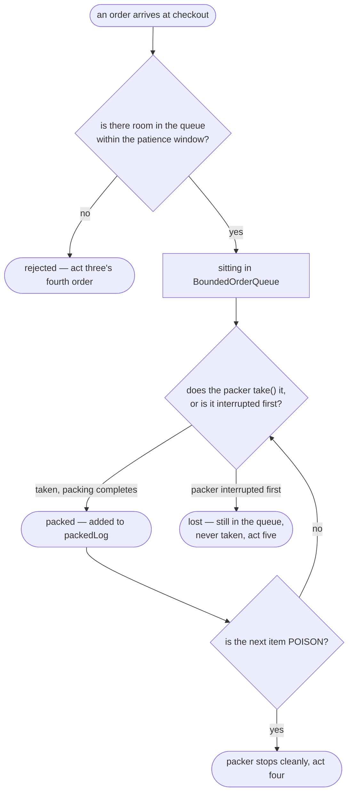

# Producer–Consumer Pattern — Data Flow Diagram

One order, from arrival to being packed — or to being rejected, or to
being lost at shutdown.

Mermaid source

## Reading The Diagram

**Two different arrows leave `Taken`, and they lead to opposite outcomes
from the same state.** An order sitting in the queue is either packed or
lost depending on nothing about the order itself — only on whether the
packer reaches it before something stops the packer first.

**`Rejected` is reached without the order ever touching the queue at all.**
The patience window in `offer` is checked before anything is enqueued,
which is the diagram's way of showing that a rejection is a decision made
at the door, not a later cleanup.
