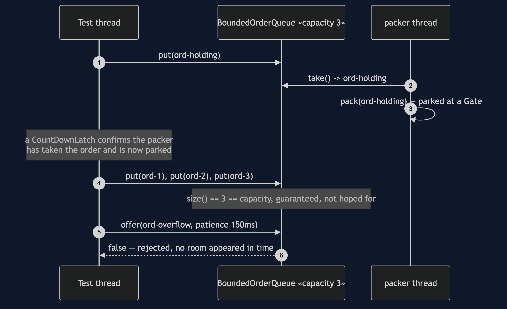
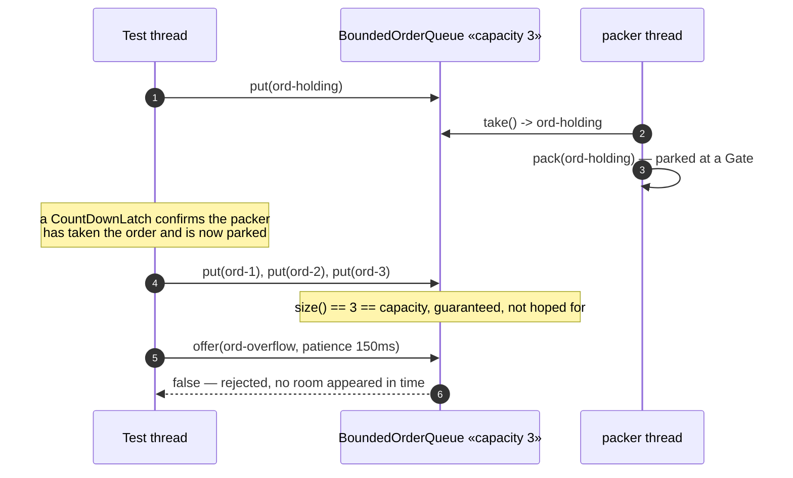

# Producer–Consumer Pattern — Sequence Diagram

Written for a listener with the screen off: who calls whom, and in what
order, when the queue is actually full.

Say it in words. A test thread puts one order onto the queue, and the
packing thread takes it immediately and starts packing — except packing,
in this scene, is deliberately parked at a closed gate rather than doing
real work, so the packer never comes back for a second order. Only once
the test thread has confirmed, with a latch rather than a guess, that the
packer really is stuck there, does it put three more orders onto the
queue. The queue is now provably at its capacity of three, because the
one consumer that could have taken any of them is busy elsewhere. A fourth
order is then offered with a patience of a hundred and fifty milliseconds.
Nothing frees a slot in that time, because nothing is going to — the
packer stays parked — so the offer is refused, and the test thread is told
so directly, rather than being left to wonder.

Mermaid source

Say the load-bearing sentence aloud, because it is the one a picture
cannot carry on its own: **the queue is not full because we counted three
puts — it is full because the one thread that could have made room for a
fourth order is proven, by a latch, to be doing something else entirely.**

For the two shutdown sequences and the harness's own lost-update proof,
see [`uml-diagram.md`](uml-diagram.md).
