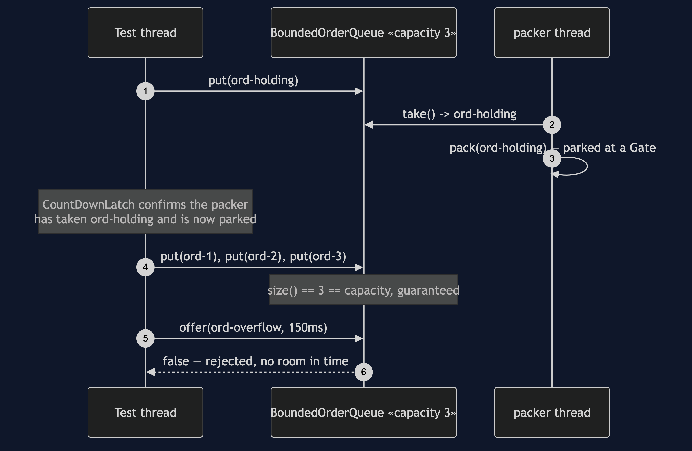
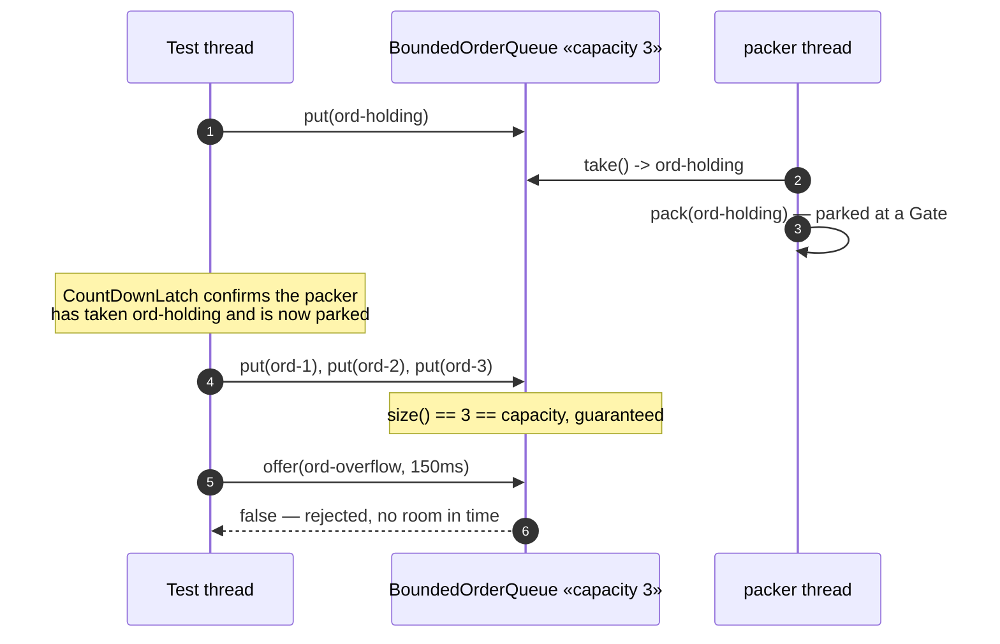
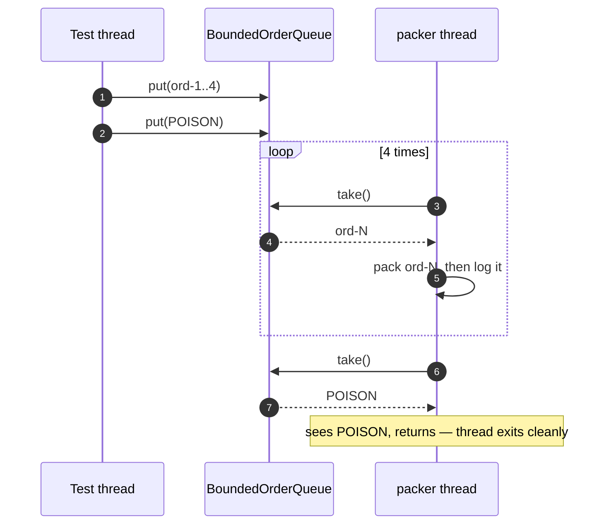
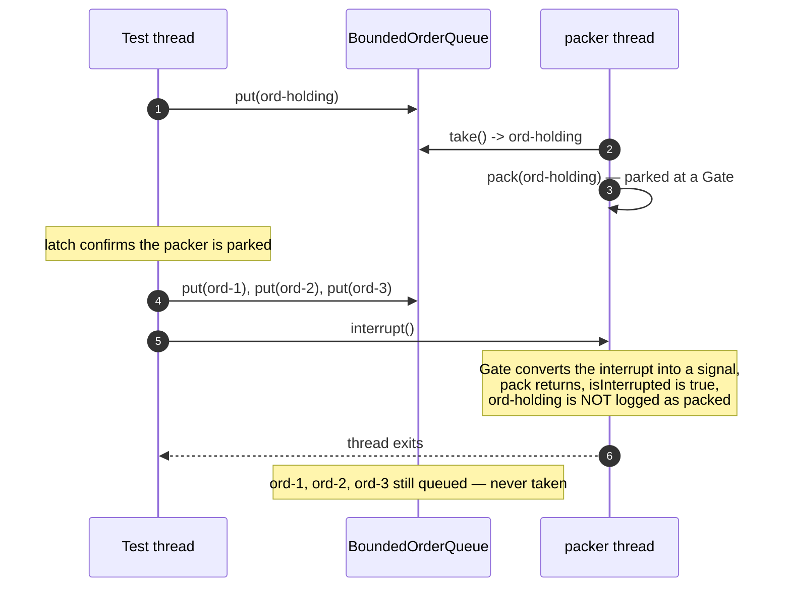
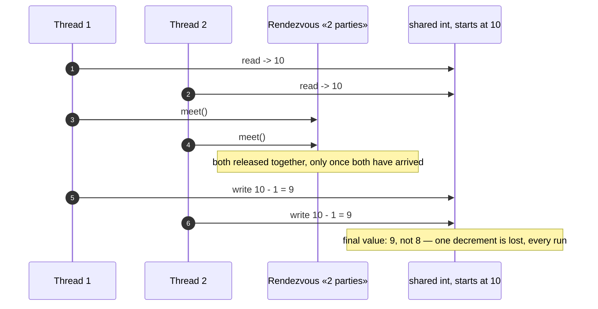

# Producer–Consumer Pattern — UML Sequence Diagrams

Four sequences: the queue at capacity, a clean shutdown, an abrupt one, and
the lost-update race the shared harness is proven against.

## 1. The Queue Reaches Capacity, And Says No

Mermaid source

## 2. Clean Shutdown — The Pill Travels Through The Queue

Mermaid source

## 3. Abrupt Shutdown — Whatever Is Queued Is Lost

Mermaid source

## 4. The Harness's Own Proof — A Lost Update, Every Run

Mermaid source

This is the mechanism reused, with different shared state, in
Read–Write Lock and Monitor Object later in this category.
