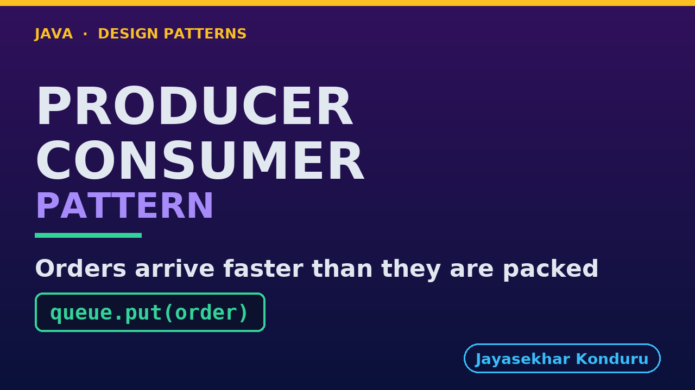

# YouTube — Producer Consumer Pattern

Everything needed to publish `video/producer-consumer-pattern-explained.mp4`. Copy the fields straight out of this file.

Chapter timings are generated from the video's `.srt`. Re-run `python3 docs/make_youtube_docs.py producer-consumer` after any change to the narration, or they will be wrong.

## Title

```
Producer-Consumer in Java - The Bounded Queue
```

45 characters — under the 60 YouTube shows before truncating in search results.

## Description

The first two lines are what a viewer sees above the fold, so they carry the hook rather than the boilerplate.

```
Learn the Producer Consumer pattern in Java with an online store where checkout accepts orders faster than the packing step can wrap them for the courier. A queue with a size limit sits between the two sides so each works at its own pace, and the limit is chosen on purpose, like the conveyor belt between a bakery's oven and its packing table. We try letting checkout pack its own orders and giving every order its own thread, then add the bound, force the queue to fill on every run, and compare a clean shutdown with an abrupt one. A queue with no limit is not safer; it is the thread-per-order failure with a nicer name.

CHAPTERS
00:00 Introduction
01:02 The Scenario
01:31 Naive One — The Checkout Thread Packs Itself
01:57 Naive Two — A Thread Per Order
02:40 The Pattern: A Bound, Chosen On Purpose
03:06 The Queue At Capacity, Forced Rather Than Hoped For
03:38 Two Shutdowns, And They Are Not The Same Event
04:10 Clean Shutdown
04:25 Abrupt Shutdown
04:45 Why Nothing In This Project Sleeps
05:17 The Harness's Own Proof
05:54 What The Scheduler Really Does
06:24 The Bill
06:59 When This Is Too Much
07:21 Thanks for Watching

SOURCE CODE, WRITTEN NOTES AND AN INTERACTIVE ANIMATION
https://github.com/jk-boot-up/java-design-patterns/tree/main/gradle-java/concurrency-design-patterns/producer-consumer-pattern

WHAT YOU NEED FIRST
Java 21 and a working knowledge of classes and interfaces. No prior design-pattern knowledge is assumed. The full prerequisites are in docs/prerequisites.md in the repository.
```

## Chapters

YouTube renders these as chapters only if there are at least three and the first is at `00:00`.

```
00:00 Introduction
01:02 The Scenario
01:31 Naive One — The Checkout Thread Packs Itself
01:57 Naive Two — A Thread Per Order
02:40 The Pattern: A Bound, Chosen On Purpose
03:06 The Queue At Capacity, Forced Rather Than Hoped For
03:38 Two Shutdowns, And They Are Not The Same Event
04:10 Clean Shutdown
04:25 Abrupt Shutdown
04:45 Why Nothing In This Project Sleeps
05:17 The Harness's Own Proof
05:54 What The Scheduler Really Does
06:24 The Bill
06:59 When This Is Too Much
07:21 Thanks for Watching
```

## Tags

```
producer consumer pattern, java concurrency, blockingqueue, design patterns, java design patterns, gang of four, java 21, software design, clean code, object oriented design, java tutorial, ecommerce, programming tutorial
```

221 characters, under YouTube's 500 limit.

## Thumbnail



**Upload `docs/thumbnail.png`** — 1280×720, the size YouTube recommends, generated by `docs/make_thumbnails.py`. It is deliberately not the same image as the video's opening frame: a thumbnail is judged at about 360 pixels wide in a search result, so this one carries only the pattern name, one line of promise and one short piece of code, each set large enough to survive the shrink.

`video/poster.png` is the 1920×1080 opening frame, produced by the video build. It stays in the repository as the title card; it is not what gets uploaded.

YouTube will not pick the thumbnail up on its own — upload it under **Details → Thumbnail → Upload file**. A custom thumbnail requires a verified channel.

## Upload checklist

- [ ] Upload `video/producer-consumer-pattern-explained.mp4` (1080p, H.264, 30 fps, AAC 48 kHz — already YouTube's recommended settings, no re-encode needed)
- [ ] Set the video language to **English** first, or the subtitle option may not appear
- [ ] Add subtitles: *Video elements → Add subtitles → Upload file → With timing* → `video/producer-consumer-pattern-explained.srt`
- [ ] Upload `docs/thumbnail.png` as the thumbnail — do not let YouTube auto-pick a frame
- [ ] Paste the title, description and tags from above
- [ ] Add to the **Java Design Patterns** playlist, in learning order
- [ ] Wait for 1080p processing before sharing the link — code slides are unreadable at 360p

## Cards and end screen

End screen links to whichever pattern video goes up next — set it at upload time rather than assuming an order.

Add a card partway through pointing at the playlist, so a viewer who arrives at this pattern from search can find the rest of the series.

## Runtime

Approximately 07:59, narrated at 145 words per minute.
