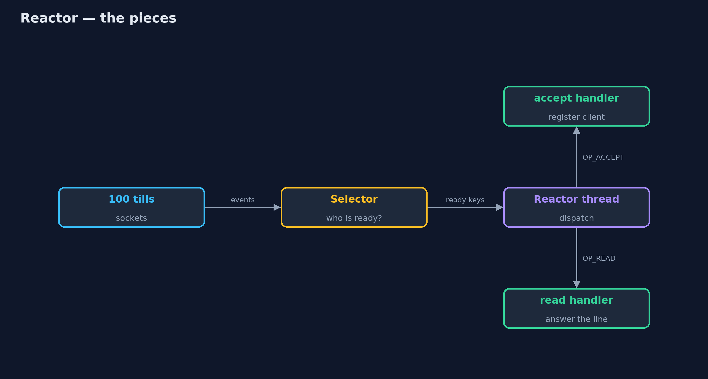
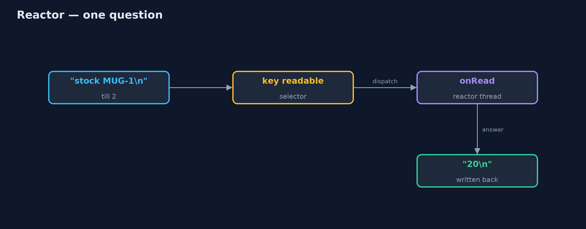

# Reactor Pattern

```
src/main/java/com/jk/explore/reactor/
├── Clients.java              Many shop tills connected at once, each able to ask one question and read the answer
├── Reactor.java              The pattern: one thread waits for events on every connection at once, and hands each event to its handler
├── ReactorDemo.java          The five acts: a thread per connection, one reactor thread, handlers by event, many clients answered, and the bill
├── StockCommands.java        What the stock server answers: a word and a product code in, one line out
└── ThreadPerConnection.java  Without the pattern: a new thread for every connection, which mostly sits waiting for the client to say something
```

**Let one thread wait for events on every connection at once, and hand each event to a short handler, instead of giving every connection a thread that mostly waits.**

Reactor is a concurrency pattern for servers with many connections. Instead
of one thread per connection, each spending most of its life waiting for the
client to say something, one thread waits for events on all connections at
once. When something happens (a new client connects, bytes arrive), an event
demultiplexer (in Java, the NIO `Selector`) says which connection is ready,
and the thread dispatches the event to its handler.

It is how Netty, Node.js, Nginx and Redis serve thousands of connections with
a handful of threads. The rule that comes with it: handlers must be quick,
because while one runs, nobody else is served.

## The idea in everyday terms

Think of one waiter looking after a whole restaurant. They do not stand beside
one table while its guests read the menu. They watch the room, and go to
whichever table raises a hand. One waiter can serve many tables that way, as
long as they never stop to cook a dish themselves; if they do, every table
waits.

## The scenario

The online store's warehouse has a stock server that shop tills and packing
stations connect to all day, asking short questions such as "stock KETTLE-1".
The server started a new thread for every connection. With a hundred tills
connected, a hundred threads sat almost entirely idle, each holding memory,
waiting for the next question.

## Run

```bash
./gradlew run
```

The demo tells the story in 5 acts, each printing exact numbers that the tests check:

| Act | What it shows |
| --- | --- |
| 1. A thread per connection | 100 tills connect and wait: 100 threads, almost all idle; the answer to stock KETTLE-1 is 4. |
| 2. One reactor thread | The same 100 tills connect to the reactor; one thread runs every handler. |
| 3. A handler per event | A new connection goes to the accept handler, arriving bytes to the read handler; price MUG-1 is 800. |
| 4. Every till, one thread | All 100 tills ask at once: 100 correct answers, still 1 thread. |
| 5. The bill | While till 2's 300 ms report runs, till 3's quick question waits over 200 ms. |

## Test

```bash
./gradlew test
```

6 tests in `DemoRunsTest`, `ReactorTest`. Every number the demo prints is asserted, and nothing depends on the clock, so every run gives the same result.

## Technologies and versions

| Technology | Version | Used for |
| --- | --- | --- |
| Java | 21 | the code (toolchain set in `build.gradle`) |
| Gradle | 9.2.1 (wrapper) | build and run, nothing to install |
| JUnit | 5.10.2 | the tests |
| videokit | repository tool | the narrated video and animation: Piper `en_US-amy-medium`, speed 0.8, longer pauses (the approved `amy-slow` voice) |

## Learning Material

| Document | What it is for |
| --- | --- |
| [Problem statement](docs/problem-statement.md) | the situation and what the project must show |
| [Prerequisites](docs/prerequisites.md) | what you need to know first |
| [Reactor, explained](docs/reactor-pattern-explained.md) | the acts in prose |
| [Session guide](docs/session.md) | a one-hour lesson with exercises |
| [Animated walkthrough](docs/animation.html) | the acts step by step, narrated |
| [Spec](docs/spec.md) | what this project must be true of |

### The pattern in one picture

One thread, one selector, many connections.



### Where each piece sits

The reactor owns the selector and the handlers.


### How the data moves

From bytes on a socket to a reply, on the one thread.



### Who calls whom, in order

Wait, dispatch, repeat.


### Video

`video/reactor-pattern-explained.mp4` (with `.m4a` audio and `.srt` subtitles) is built by `video/build_video.sh`. Rendered media is not committed.

## What it costs

- **Handlers must never block.** One 300 ms handler held up every other client in the demo.
- **Harder code.** Reads can arrive in pieces, and state for each connection must be kept by hand.
- **One core.** A single reactor thread uses one CPU core; busy servers run several reactors.

## When this is too much

With a few dozen connections, or with Java 21's virtual threads, a thread per
connection is simpler and performs well. Reactor pays off with thousands of
mostly idle connections, or where platform threads are expensive.

## Where you have already met this

- Java NIO's `Selector`, `ServerSocketChannel` and `SocketChannel`.
- Netty's event loops, used by gRPC, Cassandra and many Java servers.
- Node.js's event loop, Nginx, and Redis.
- Spring WebFlux and Vert.x, built on reactors.

## Where this sits

This project is in [concurrency-design-patterns](..), next to
[Thread Pool](../thread-pool-pattern), which a reactor often hands its slow
work to, and [Proactor](../proactor-pattern), its asynchronous-completion
cousin.
