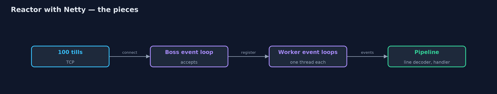
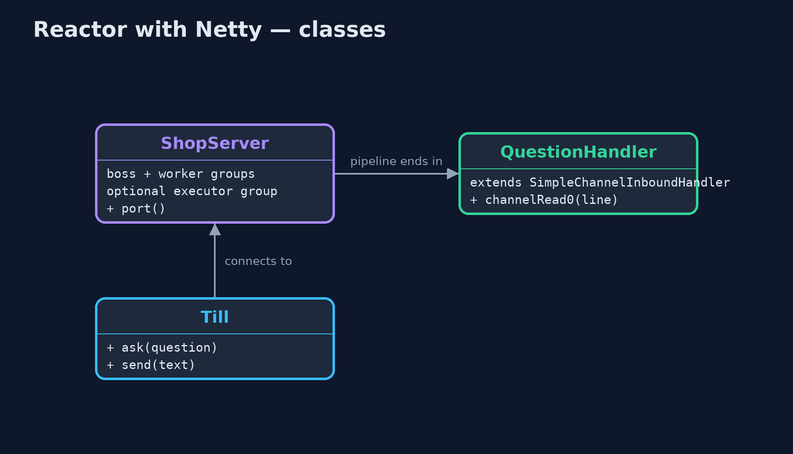
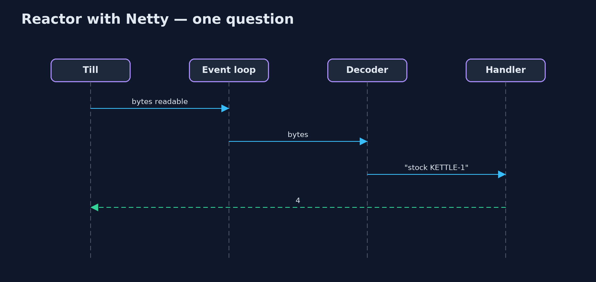

# Reactor with Netty Pattern

```
src/main/java/com/jk/explore/reactornetty/
├── NettyReactorDemo.java  The five acts, with a real Netty server and real TCP connections from 100 tills
├── ShopServer.java        The shop's stock server on Netty
└── Till.java              A shop till: an ordinary blocking TCP client that asks the server one line at a time
```

**Serve a hundred shop tills from one Netty event loop, let the channel pipeline turn bytes into whole questions, spread connections over several event loops, and move slow work off the loop.**

This is the framework version of the Reactor pattern. The plain Java version,
a separate project in this category, builds a reactor from the JDK's NIO
`Selector`. Here Netty, the networking library underneath much of the Java
world, provides it: an event loop is a reactor running on one thread,
waiting on many connections at once and calling handlers when something
happens.

Netty adds three things the plain version wrote by hand or did not have. A
channel pipeline of handlers, where ready-made decoders turn bytes into whole
lines. A boss event loop that accepts connections and several worker event
loops that serve them, the multi-reactor. And executor groups, so a slow
handler can run away from the event loop instead of blocking it.

## The idea in everyday terms

Think of a restaurant with one very fast waiter covering many tables. The
waiter never stands at a table waiting for someone to decide; they go wherever
a hand is raised. If the restaurant grows, it adds a few more such waiters,
each looking after their own tables. And if someone asks for a dish that takes
an hour, the waiter passes it to the kitchen rather than standing there
cooking it.

## The scenario

The online store's shops have a hundred tills that stay connected to a stock
server and ask short questions such as "stock KETTLE-1". A thread per till
meant a hundred threads, almost all of them idle, waiting.

## Run

Nothing to install beyond a Java 21 JDK: the Netty server and the hundred till
connections run inside the program, on the local machine.

```bash
./gradlew run
```

The demo tells the story in 5 acts, each printing exact numbers that the tests check:

| Act | What it shows |
| --- | --- |
| 1. One event loop | 100 tills connect to a Netty server with one worker event loop; till 1 gets stock 4, and handlers run on 1 thread. |
| 2. The pipeline | Till 2 sends "price MU" and "G-1" as two writes; LineBasedFrameDecoder waits for the end of the line, and the answer is 800. |
| 3. Everyone at once | 100 tills ask at once: 100 correct answers, all handled by the one event-loop thread. |
| 4. Several event loops | With 4 worker event loops, the 100 connections are spread over 4 threads, and each connection stays on its own. |
| 5. The bill: never block | A 300 ms report on the event loop makes a quick question wait over 0.2 s; on its own executor group, it is answered in under 0.2 s. |

## Test

```bash
./gradlew test
```

1 tests in `DemoRunsTest`. Every result the demo prints is asserted, with a real Netty server on a local port and real TCP clients. Timings are printed as thresholds.

## What the simulation got right, and what it left out

The plain Java version got the idea right: one thread waits on every
connection with a selector, dispatches each event to its handler, answers
every till, and is held up by any handler that blocks. What it left out is
what a production reactor library adds. Netty's pipeline reassembles a
question sent in two pieces, so the handler only sees whole lines. Its boss
and worker groups run several reactors, with each connection staying on one
thread. And an executor group moves a slow handler off the event loop, so a
quick question no longer waits behind a slow report.

## Technologies and versions

| Technology | Version | Used for |
| --- | --- | --- |
| Java | 21 | the code (toolchain set in `build.gradle`) |
| Gradle | 9.2.1 (wrapper) | build and run, nothing to install |
| JUnit | 5.10.2 | the tests |
| Netty | 4.2.18.Final | event loops, channel pipeline, codecs, executor groups |
| videokit | repository tool | the narrated video and animation: Piper `en_US-amy-medium`, speed 0.8, longer pauses (the approved `amy-slow` voice) |

## Learning Material

| Document | What it is for |
| --- | --- |
| [Dependencies](docs/dependencies.md) | what the framework and infrastructure are, and why they are here |
| [Problem statement](docs/problem-statement.md) | the situation and what the project must show |
| [Prerequisites](docs/prerequisites.md) | what you need to know first |
| [Reactor with Netty, explained](docs/reactor-with-netty-pattern-explained.md) | the acts in prose |
| [Session guide](docs/session.md) | a one-hour lesson with exercises |
| [Animated walkthrough](docs/animation.html) | the acts step by step, narrated |
| [Spec](docs/spec.md) | what this project must be true of |

### The pattern in one picture

Accept on the boss; serve on the workers.



### Where each piece sits

A server and its handler.



### How the data moves

Bytes in, one whole line out.


### Who calls whom, in order

The event loop runs the pipeline.



### Video

`video/reactor-with-netty-pattern-explained.mp4` (with `.m4a` audio and `.srt` subtitles) is built by `video/build_video.sh`. Rendered media is not committed.

## What it costs

- **Never block the loop.** A 300 ms report held up a quick question for over 0.2 s until it was moved to its own executor group.
- **A new vocabulary.** Channels, pipelines, handlers, event loops and executor groups.
- **Framing and memory are yours to decide.** Decoders, buffer sizes and limits must be chosen.

## When this is too much

For a handful of connections, a thread each is simpler and perfectly fine.
Netty pays off with many connections that are mostly idle, or when you need
full control of a network protocol.

## Where you have already met this

- Netty underneath gRPC, Spring WebFlux, Vert.x and many databases' drivers.
- Node.js's event loop and Nginx's worker processes.
- The JDK's NIO `Selector`, which Netty's NIO transport is built on.

## Where this sits

This project is in [concurrency-design-patterns](..). It is the framework
version of the plain Java Reactor project in the same category, which is left
unchanged.
